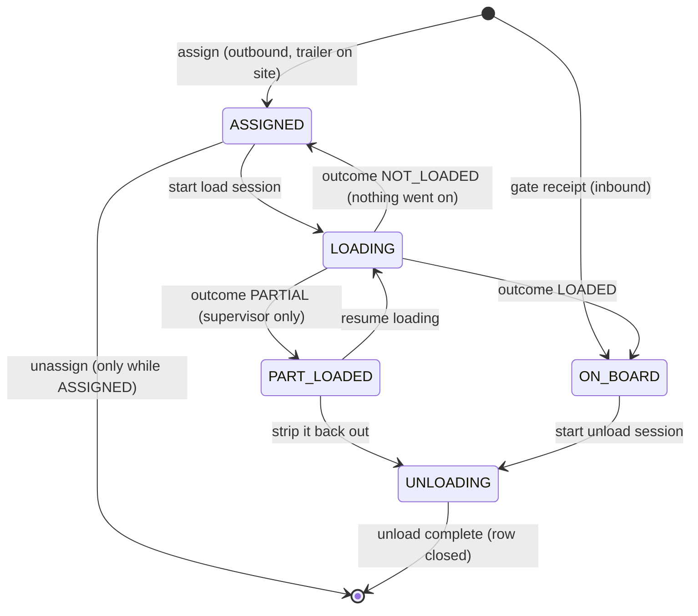
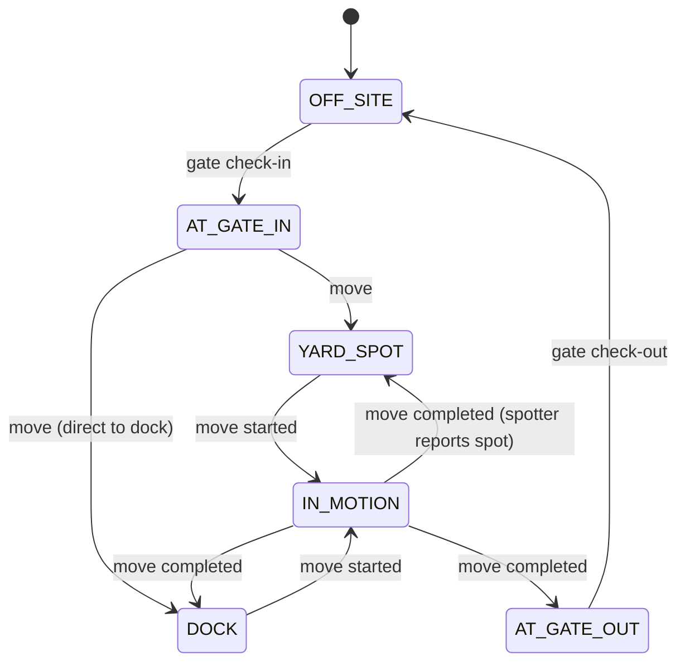
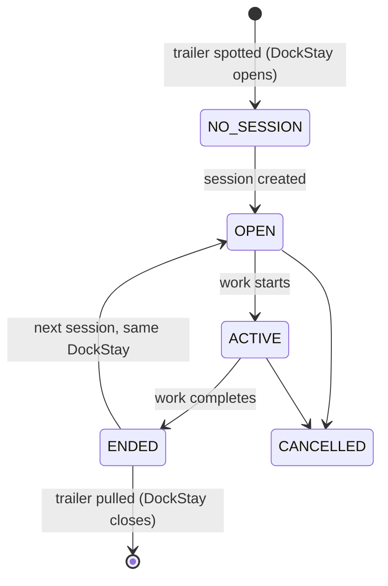

# Yard, Dock & Appointment Operations — Domain Model and UI Specification

**Status:** Draft v0.22 — outbound preload; departure scoped to the driver's own trailer
**Purpose:** Define the entities, independent state dimensions, actions, derived work queues, and trailer-card display rules needed to manage trailers, shipments, and appointments at a distribution facility.

### Changes from v0.21

**Reported from operations, not found by the engine:** what the document set called a "preload pickup" is two different patterns, and only one of them was modelled.

- **Pattern 4 renamed to "outbound pickup", and pattern 4a added — the outbound preload** (§4). One appointment the driver attends twice: he brings an empty trailer, leaves, and returns for it loaded. Its legs are identical to pattern 2's, so the old table could express it and the machinery could not run it — `AUTHORIZE_DEPARTURE` blocked the first departure outright. One name, "preload pickup", had been covering both patterns, which is how the distinction went missing.
- **`AUTHORIZE_DEPARTURE` and `CHECK_OUT` are scoped to the trailer the driver actually has** (§5.1), which custody already knows — not to every leg of the appointment.
- **The per-visit fields in §2.4 are marked as such**, and the dockpass is one per visit rather than one per appointment (§2.5).
- **§10.13 added** — an appointment is not one visit. The outbound preload needs two presence lifecycles, two dockpasses and two detention spans on one booking, and §2.4's "an appointment is a visit" left nowhere to put them. §10.12's custody span is what makes the fix cheap, so **decide §10.12 and §10.13 together.**
- **Four stress tests added** (22a–22d), including the two patterns side by side, since the risk now is a screen or a metric treating them as one thing.
- **§2.4 no longer says an appointment *is* a visit.** It is a booking that may be attended more than once.

### Changes from v0.20

Every change here came from implementing this document as an executable rule engine and walking the seven flows and the stress tests through it. Each is a place where the engine could not satisfy all four documents at once. Four new stress tests (12a–12d) guard the ones that would silently regress.

- **`POSITION_TRAILER` added** (§5.2). §5 previously had no action that moved a trailer with a tractor attached: `CREATE_MOVE_TASK` is hidden while one is, and `COMPLETE_MOVE` requires a task. Flows 1, 2, 3 and 5 and stress tests 1-vi, 1-x and 12 each had a step with nothing behind it, and `AT_GATE_OUT` was unreachable for a live load.
- **`tractor` is stored, not derived** (§3.5, §6.1). It sat in the derived-flags table under "computed, never stored" with nothing in the model to compute it from. Its writers are now named, and **`BIND_TRAILER_TO_LEG` sets it on a BRING leg** — a trailer that was driven here is hooked from arrival. Missing that one assignment makes every live load generate a move task for the yard team.
- **`CHECK_OUT` sets `presence → DEPARTED`**, not `CHECKED_OUT` (§5.1). The latter is not a value of any dimension; `PAST_WINDOW` (§6.1) referenced it too.
- **`TURN_AWAY`'s preconditions rewritten** (§5.1). They named `ARRIVED` and `CHECKED_IN`, both retired (glossary §3).
- **`ADMIT` accepts an RF badge** as a third credential and no longer requires a BRING leg that may not exist (§5.1). Flows §8 describes a company driver admitted on a badge with no dockpass; nothing in §5.1 permitted it.
- **`SELF_REGISTER`'s effects now cover a TAKE-only visit** (§5.1) — patterns 4 and 8 have no BRING leg to bind and no trailer to set a destination on.
- **`VERIFY_EMPTY` keyed on nothing being aboard** rather than load state `EMPTY` (§5.1), which an outbound live load stops satisfying the moment its leg is bound.
- **`ADVANCE_READINESS` added** (§5.5). §3.7 defined three readiness states and named no action that moved between them, so flow 7's prep steps had no catalog entry.
- **Three open items added:** §10.10, whether appointment-driven binding needs the empty check `ASSIGN_SHIPMENT` has; §10.11 on `AT_FACILITY`; and **§10.12, the largest of the three — custody, `TrailerStay`, and the several histories.** §10.12 supersedes the `tractor` change above as an end state: a stored boolean answers "is this trailer my work" and discards "whose work was it", which is what the history is actually asked. Under it `TRACTOR_ATTACHED` becomes genuinely derived and §6.1's original classification of it turns out to have been right.

**Still open from the same round, and deliberately not changed here:** `presence` is an Appointment dimension, but `COMPLETE_MOVE` (§5.2) and stress test 1-xiv both change it when a move crosses the fence — including for a company return that has no appointment at all (§4 pattern 9). Either presence is partly a trailer dimension or fence-crossing needs its own trailer-level fact, and that is a modelling decision rather than a correction.

### Changes from v0.19
- **`CLEAR_VISIT` → `AUTHORIZE_DEPARTURE`**, and the state `CLEARED` → `AUTHORIZED_TO_DEPART` (§9 #38). "Clear" was on the banned-terms list while the action still used it.
- **`DEPARTED_WITHOUT_CLEARANCE` → `DEPARTED_WITHOUT_AUTHORIZATION`.**
- **`SPOTTED` removed from the destination dimension** (§3.6.3) and narrowed to its industry meaning: a trailer placed at a dock. It is now a **sensor-backed derived condition**, not a stored destination value.
- **Dock presence sensors added** (§2.9). An independent observation, like the gate camera — with three informative mismatches (§6.1) and the ability to auto-confirm spot-in rather than relying on a report.
- **New derived flag `AT_DESTINATION`** — position matches destination, computed rather than stored.

### Changes from v0.18
- **Shipments derive from the appointment** (§9 #37). An appointment already names what is being delivered or shipped, so nothing needs re-stating at the dock.
- **`BIND_TRAILER_TO_LEG` now creates rows for both directions** (§5.1): `ON_BOARD` for a BRING leg, `ASSIGNED` for a TAKE leg. Outbound assignment stops being a manual step for appointment-driven work.
- **Sessions open pre-populated** (§2.7, §5.3). A session defaults to every eligible row on the trailer; `ADD_`/`REMOVE_SHIPMENT_FROM_SESSION` become **exception paths**, not the normal flow.
- **`ASSIGN_SHIPMENT` is now the exception too** — it covers preloads and the empty-trailer-at-a-dock case, which have no appointment to derive from.

### Changes from v0.17
- **"Door" renamed "dock" throughout** (§9 #36), matching the vocabulary the operation actually uses. `DoorAssignment` → `DockAssignment`, `ASSIGN_DOOR` → `ASSIGN_DOCK`, `DOOR_ASSIGNED` → `DOCK_ASSIGNED`, `PULL_FROM_DOOR` → `PULL_FROM_DOCK`, `BLOCKING_DOOR` → `BLOCKING_DOCK`, `door_id` → `dock_id`.
- **Queue names disambiguated.** Renaming created a collision, so the two are now **Dock Assignment Queue** (which dock a trailer gets) and **Dock Work Queue** (loading and unloading).
- Resolves an inconsistency the model carried from the start: `DockStay`, `DockSession`, and `Dockpass` already said dock while the position said door.

### Changes from v0.16
- **Design principle added** (§1.2): capabilities generalize by **defaulting**, not by feature flags. A flag is only justified when it changes a *precondition*, never merely to enable a data field (§9 #35).
- **Reconditioning generalized to readiness requirements** (§3.7). A facility-defined list — cleaning, reefer pre-cool, washout, DOT inspection, tarp check — where an **empty list collapses the dimension to nothing**.
- **Company fleet patterns marked optional** (§4). Patterns 8 and 9 are available, not assumed.
- **Available pool generalized** (§6.4). Useful to any facility that preloads, not only circulating fleets.

### Changes from v0.15
- **Company fleet cycle modelled** (§9 #34): clean → available → load → route → return → clean. The first pattern in this model where a trailer is a *circulating asset* rather than a visitor.
- **Reconditioning dimension added** (§3.7) — generalized to readiness requirements in v0.17. Physical preparation, not paperwork, is what gates assignability.
- **Available-pool view added** (§6.1, §6.4). The number this operation runs on daily: clean, empty, in-service, unassigned trailers ready for tonight.
- **`party_type` and `access_method` on appointments** (§2.4). Company drivers use RF badge access with lighter ceremony — but freight attribution is **not** relaxed (§5.1).
- **Two new visit patterns** (§4): company TAKE-only departure, and unappointed return.
- **Cleaning capacity flagged** as a possible fourth constraint (§10.9).

### Changes from v0.14
- **Outside lots never hold freight** (§9 #33). They are for live loads registering and for company trailers returned from route. `UNSECURED_FREIGHT` is repurposed as a **policy-exception** flag — wrong place, not stolen (§6.1).
- **Perimeter risk accepted, with reasoning recorded** (§10.8). Empties only; daily reconciliation bounds the asset exposure.
- **Unappointed trailer returns added** (§2.13, §5.5). A company trailer dropped after a route has **no appointment, no registration, and no visit** — a path the model did not have.
- **`ENTERED_WITHOUT_CHECKIN` scoped by location** (§6.1). At the gate it is a security finding; in an outside lot it is routine.
- **Yard checks gain a positive role** (§2.12): discovering returned trailers, not only catching errors.

### Changes from v0.13
- **Lots have a `side`** — inside or outside the fence — and which lots exist is per-facility inventory (§2.9, §9 #32). Resolves the §10.8 tension.
- **`AT_FACILITY` can now hold a position**: a trailer parked in an outside lot is at the facility but not through the gate (§3.6.2).
- **Perimeter blind spot named** (§10.8). An outside lot has no gate, so a trailer taken from it produces no exit read, no check-out, and no alarm — the only place the identification layer has no coverage.
- **Moves can cross the fence** (§5.2), which changes a trailer's on-site status and starts or stops clocks.
- **Detention argument sharpened again** (§10.6): a driver parked in *your* outside lot at *your* direction is harder to argue isn't detention than one idling in the gate lane.
- **Yard checks must cover outside lots** (§2.12), which is more ground with less visibility.

### Changes from v0.12
- **Registration requires physical presence** (§9 #31). The driver scans a QR code on a sign at the facility; there is no remote check-in.
- **New presence state `AT_FACILITY`** (§3.6.2). "Pending Gate Check-In" means *at the facility, outside the fence* — not off site, as v0.12 had it.
- **Dock-holding concern retracted** (§2.14). The registration-to-admission window is minutes, not hours, so pre-assignment is not speculative. A hold expiry remains as a minor safeguard only.
- **Detention largely resolved** (§10.6). A QR scan is driver-initiated, timestamped proof of arrival — stronger evidence than a guard's clock. `RECORD_ARRIVAL` becomes redundant for self-registering drivers.
- **Dockpass security framing corrected** (§2.4). The pass is issued *after* identification, so it does not stand in for it. One narrow residual: the kiosk must rate-limit attempts.

### Changes from v0.11
- **`DRIVER_SELF` deleted as a MoveTask executor** (§3.5, §9 #30). A tractor-attached trailer has a *destination*, not a task. Move tasks exist only for trailers with nothing to pull them.
- **`DROP_TRAILER` / `HOOK_TRAILER` added** (§5.2). The model never recorded the moment a tractor detaches — which is exactly the handoff from the driver's responsibility to the yard team's.
- **`destination_state` moved from Appointment to Trailer** (§3.6.3). A dropped trailer is `Awaiting Dock` long after its appointment ended; destination cannot live on the visit.
- **Gate admission decision for live loads with no dock** (§5.1): hold outside the fence, or admit to a yard spot — decided on in-gate spot availability.
- **Tension flagged** between that decision and "the yard is never full" — resolved in v0.14 (§9 #32).
- **Named honestly:** holding trucks outside the gate suppresses the detention clock (§10.6).
- **Move-task creation on dock assignment may be automated or manual, per facility** (§2.11).

### Changes from v0.10
- **`visit_state` decomposed into three dimensions** (§3.6): registration, presence, destination. A single enum could not express `Awaiting Dock — Pending Gate Check-In`, which is a composition (§9 #29).
- **Two-stage check-in.** Self-registration on mobile (appointment ID + trailer number → dockpass) and gate admission are separate events. **The bare term "check in" is banned** from the model — it means two different things (§3.6).
- **`Dockpass` added** (§2.4) — a bearer credential for facility access, with the security constraints that implies.
- **Dock assignment is now an explicit decision** (§2.14, §5.2). v0.10 jumped from check-in to a move task with a dock already chosen; nobody ever decided which dock. Assignment may precede arrival.
- **Third queue: Dock Assignment** (§6.2) — upstream of the dock work queue, not part of it. Corrects last revision's framing of a "gate queue."
- **Detention sharpened** (§10.6): self-registration is *not* a detention candidate, which narrows the real choice to arrival versus admission.

### Changes from v0.9
- **Correction.** Camera reads are too slow to gate entry or exit (§9 #28). All camera-based blocking is removed — `CHECK_OUT` no longer requires a corroborated read.
- **Cameras are a detective control.** Their value at exit is *detection speed*, not prevention: minutes instead of days (§5.1).
- **Recovery workflow added** (§5.1, §6.1). A wrong-trailer exit is now an urgent recovery event with a decaying window, not a blocked gate.
- **`CORRECT_DEPARTURE` added** (§5.5) — the model previously had no way to amend an already-completed check-out.
- **The fast checks stay preventive.** On-site collision and near-match are database lookups on typed input, not camera-dependent, and remain hard blocks.
- **Departure time is the image *capture* timestamp**, not the processing time (§3.6) — slow to read, still accurate to the second.

### Changes from v0.8
- **Correction.** v0.8 hard-blocked any exit read that disagreed with the TAKE leg. That was wrong: a driver who *declares* taking a different trailer is amending the plan, not making an error. Exit reads now corroborate against the **declaration at checkout** (§5.1).
- **`DECLARE_TAKE_LEG_CHANGE` added** (§5.1) — substitution and bobtail-instead-of-pickup are normal, logged amendments.
- **Risk scoped to loaded substitutions** (§5.1). Empty-for-empty is trivial; leaving with a different *loaded* trailer means another party's freight departed.
- **`UNDECLARED_TRAILER_EXIT`** replaces `WRONG_TRAILER_EXITING` — the alarm is the *absence of a declaration*, not the substitution.
- **`pickup_mode` is per carrier and per facility** (§9 #27).

### Changes from v0.7
- **Exit reads confirmed** (§9 #26). Exit identification catches a *physical* error — the wrong trailer hooked — not a transcription one (§5.1).
- **`NO_TRAILER` is a valid exit read** (§2.15), so bobtail departures don't generate endless unmatched exits.
- **Departure time comes from the exit read where available** (§3.6), which is more defensible in a detention dispute than a clerk's click.
- **`DEPARTED_WITHOUT_AUTHORIZATION` added** — the exit analogue of an unauthorized entry, routed to security.
- **Hook-time verification raised** (§10.5) as the cheaper upstream control, since the exit gate is the *last* line of defence, not the first.

### Changes from v0.6
- **Config is facility-owned, seeded by copy at facility creation — not live inheritance** (§2.11). Divergence between facilities is expected and is not reported on (§9 #25).
- **Metric comparability is now the constraint that config freedom buys** (§10.3). Config-dependent metrics are not roll-up-safe across facilities.
- **Effective-config view retained for support** (§10.2) — a different thing from a divergence report, and still needed.

### Changes from v0.5
- **Identification is multi-source** (§2.13). `TrailerIdentification` records each reading — guard, driver, or camera/AI — rather than storing one number on the trailer.
- **Corroboration replaces near-match as the primary control** where cameras exist; near-match remains the fallback where they don't (§5.1). Both are facility config, neither is deleted.
- **Asymmetric one-sided outcomes** (§5.1). An AI read with no check-in is a gate-control finding; a check-in with no AI read is a missed read. They route differently.
- **`RESOLVE_IDENTIFICATION` added** (§5.1), recording which source was correct — so per-source accuracy becomes measurable instead of assumed.
- **Exit reads** raised as a departure control (§10.5).

### Changes from v0.4
- **Trailer records are created at the gate** (§2.1, §5.1). Trailers are not pre-registered; the number comes from the driver or guard during check-in.
- **`identified_by` recorded** on gate identification — a data-quality signal, not just an audit field.
- **Near-match warning and on-site collision check** added to `BIND_TRAILER_TO_LEG` (§5.1), because human transcription creates duplicate trailer records.
- **`CORRECT_TRAILER_IDENTITY` and `MERGE_TRAILERS` added** (§5.5) — v0.4 had no path back from a misidentified trailer once sessions and rows pointed at the wrong record.

### Changes from v0.3
- **Multi-tenant SaaS structure** (§2.11). Tenant → Facility, with the facility as the operational boundary. **No global trailer registry and no inter-facility tracking** — a departing trailer is simply `OFF_SITE`.
- **`sequence` deleted from TrailerLoad, and reachability enforcement removed entirely** (§9 #15). Unload order is physically determined, not a choice the software should police.
- **Partial receipt added** (§2.5, §5.1). An LTL trailer can now legitimately depart with freight still aboard — a real gap the reachability discussion exposed.
- **`SessionShipment` junction** (§2.7) with `joined_at`, recovering some of the per-shipment timing lost in v0.3. Shipments may be added to an `ACTIVE` session (§9 #17).
- **Overflow `LOT` is a normal location, not an exception** (§2.9). `YARD_FULL` and `UNDESIGNATED_PARKING` removed.
- **Yard spots are interchangeable** (§9 #20); **daily reconciliation** (§9 #22) with `position_confidence`.

### Changes from v0.2
- **DockSession now covers one or more shipments** (§2.7). `END_SESSION` becomes a per-shipment reconciliation, and per-shipment labour timing is lost.
- **New link state `PART_LOADED`** (§3.2.1) — required by supervisor override of a cancelled session; blocks sealing and departure.
- **YardSpot is now a tracked inventory** with occupancy, reservation, and conflict handling (§2.9).
- **Unload reachability is enforced where sequence is known** — derivable for outbound, often unknown for inbound (§9 #15).
- **Cross-dock mixing forbidden** (§9 #16). Mixed-direction rows are an integrity alarm.
- **FacilityConfig introduced** (§2.11) — this is now a multi-facility system, which is a larger scope question than the permission that revealed it.
- **Staged-aging thresholds deliberately unset** pending measurement (§10.3).

### Changes from v0.1
- **`pool_owner` renamed to `carrier`** (§2.1).
- **Multi-shipment trailers.** Shipment link is now a junction entity (`TrailerLoad`, §2.3). Trailer load state is derived, not stored (§3.1–3.2).
- **`fill_declaration` added.** With multiple shipments per trailer the system cannot infer "full"; a human declares completion (§3.2.3).
- **Inbound shipments bind at the gate.** An inbound shipment attaches to a VisitLeg, and its `TrailerLoad` row is created at check-in directly in `ON_BOARD` (§5.1).
- **Outbound assignment requires the trailer on site** (§5.4).
- **Spotter-chosen destinations.** MoveTask now has `requested_destination` (optional for yard spots) and a mandatory `actual_destination` report (§2.8).
- **Carrier and dock constraints removed** (§9 #1, §9 #7).
- Detention is measured per appointment (§9 #3). Mid-load reassignment prohibited (§9 #5). Empty is driver-claimed with optional verification (§9 #6).

---

## 0. How to read this document

Sections 1–4 define *what exists* and *what can be true*. Section 5 defines *what a user can do*. Sections 6–8 define *what a user sees*. Section 9 records resolved decisions with their consequences. Section 10 lists the decisions still open. Section 11 is a set of stress tests — scenarios that must be expressible in this model, and which should be used to attack it before any code is written.

---

## 1. Core principle: there is no single "trailer status"

The instinct is to give a trailer one status field: `INBOUND_LOADED`, `AT_DOCK_UNLOADING`, `EMPTY_IN_YARD`, and so on. This fails immediately, because the things you need to know about a trailer are **independent and simultaneous**:

- A trailer can have one shipment on board, a second half-loaded, and a third merely assigned, **while** sitting at a dock **with** a pending move task **and** a driver waiting on site.

An enumerated status would need the cross-product of all those dimensions — hundreds of values, most of them nonsense, and every new business rule multiplies the list again.

**Instead: a trailer has several orthogonal state dimensions, each with its own small state machine. "Status" is never stored; it is rendered as a set of badges, one per dimension.** This is also what makes the display requirement solvable: each badge answers exactly one question, so a user reading a trailer card gets the full picture without needing to memorize a taxonomy.

The five trailer dimensions:

| # | Dimension | Question it answers | Owned by |
|---|---|---|---|
| 1 | Load state | Is there freight physically on it? | Derived from TrailerLoad rows |
| 2 | Shipment links | Which shipments are tied to it, and is each aboard or only planned? | TrailerLoad (one row per shipment) |
| 3 | Position | Where is it right now? | Trailer ↔ Location |
| 4 | Dock activity | Is a load/unload underway at a dock? | DockSession |
| 5 | Movement | Does it need to move, and who moves it? | MoveTask |

Plus one dimension that belongs to the *visit*, not the trailer:

| 6 | Visit state | What is the driver's appointment doing? | Appointment |

### 1.2 Capabilities generalize by defaulting, not by flags

This is multi-tenant SaaS (§9 #19), and customers' operations differ structurally — one runs a circulating company fleet with nightly reconditioning (§9 #34), another is a pure third-party cross-dock that never touches a trailer's condition. **Both must work without either carrying the other's machinery** (§9 #35).

The temptation is a feature flag per customer-specific behaviour. Resist it: after thirty customers that is thirty flags and a combinatorial space nobody has tested, plus thirty support answers to "why does it do that." The discipline:

| Kind of difference | How to handle it | Cost when unused |
|---|---|---|
| **A data dimension** some customers use | Always present, with a default state it never leaves | Zero — one state, no branches |
| **A workflow** some customers run | Available, simply unused. No flag | Zero — patterns nobody triggers |
| **A precondition** that differs | **Facility config.** This is the only case a flag is justified | One branch, explicitly tested |

Worked examples:

- **Readiness requirements** (§3.7) — a *list*. Empty list means every trailer is immediately available and the dimension is invisible. No flag needed for the data; one flag for whether readiness *gates assignment*, because that changes a precondition.
- **Company fleet patterns** (§4 #8, #9) — workflows. A facility with no company drivers never triggers them, and nothing needs configuring.
- **`party_type`, `access_method`** (§2.4) — dimensions with defaults (`THIRD_PARTY`, `DOCKPASS`). Unused values cost nothing.
- **Camera identification** (§2.15) — genuinely a capability flag, because its absence changes which controls are preventive (§5.1).

The test before adding a flag: **if this were always on, would anything break?** If not, it is a default, not a flag.

---

## 2. Entity glossary

### 2.1 Trailer
The physical asset. Persistent identity across many shipments and visits.

| Field | Notes |
|---|---|
| `trailer_id` | Business identifier (carrier + number) |
| `carrier` | The carrier / fleet that owns the equipment. Recorded for reporting only — **not** an assignment constraint (§9.1) |
| `type`, `length`, `features` | Dry van, reefer, 53'/48'. Advisory when matching to a shipment; not enforced against docks (§9 #7) |
| `load_state` | Dimension 1 — **derived**, never stored (§3.1) |
| `fill_declaration` | `OPEN` \| `COMPLETE` — human declaration that no more freight is going on (§3.2.3) |
| `position_state` + `location_ref` | Dimension 3 (§3.3) |
| `seal_number`, `sealed_at` | Nullable |
| `empty_verification` | `UNVERIFIED` \| `CLAIMED_EMPTY` \| `VERIFIED_EMPTY` (§9 #6) |
| `service_state` | `IN_SERVICE` \| `OUT_OF_SERVICE` (damage, reefer failure, DOT hold) |
| `created_via` | `GATE_IDENTIFICATION` \| `IMPORTED` \| `MANUAL` |
| `first_seen_at`, `last_seen_at` | |
| `identity_confidence` | Derived from corroborating identifications (§2.15): `CORROBORATED` \| `SINGLE_SOURCE` \| `DISPUTED` |

**Trailers are not pre-registered.** The number arrives from the driver or the guard during check-in (§9 #23), which means the first appearance of a number *creates* the record, and every later appearance of the same carrier-and-number reuses it. That reuse is where the value lives: history accumulates across visits, so a trailer that was trouble last month is recognizable this month.

It is also the weak point. Human transcription at a gate produces typos, and a typo does not fail — it silently creates a second trailer record for the same physical asset, which then accrues its own history, its own shipment rows, and its own dock session. §2.13 and §5.1 describe the controls that catch it; §5.5 is the path back when they don't.

Note that `load_state` appears in this table only as a reminder that it is *computed*. It must not exist as a column; if it does, it will eventually disagree with the TrailerLoad rows, and the rows are the truth.

### 2.2 Shipment
A unit of freight with a direction. Exists independently of any trailer — this is what makes preloading, multi-shipment trailers, and gate-time binding possible.

| Field | Notes |
|---|---|
| `shipment_id` | |
| `direction` | `INBOUND` \| `OUTBOUND` |
| `party` | Vendor (inbound) or customer/consignee (outbound) |
| `status` | See §3.2.2 |
| `cutoff_time` | Outbound: when it must leave. Drives dock priority. |
| `preferred_trailer_features` | Advisory only |

A shipment's trailer relationship lives entirely in TrailerLoad. There is no `trailer_id` column on Shipment.

### 2.3 TrailerLoad — the shipment↔trailer junction
**One row per shipment-on-a-trailer relationship.** This entity exists because one trailer can carry several shipments.

| Field | Notes |
|---|---|
| `trailer_load_id` | |
| `trailer_id` | Many rows per trailer |
| `shipment_id` | **Unique** — enforces "one shipment cannot be on two trailers" (§9 #4) |
| `link_state` | `ASSIGNED` \| `LOADING` \| `ON_BOARD` \| `UNLOADING` (§3.2.1) |
| `assigned_at`, `loaded_at`, `unloaded_at` | |
| `created_via` | `PLANNED_ASSIGNMENT` (outbound) \| `GATE_RECEIPT` (inbound) |

The uniqueness constraint on `shipment_id` is the single most important line in this schema. It is what keeps a one-to-many relationship from silently becoming many-to-many the first time someone splits a load.

**`sequence` has been deleted.** v0.3 carried a physical-position field to support unload-order enforcement. Your point is correct and it removes the whole apparatus: if you are unloading a trailer, you unload it in the order it comes off — that order is imposed by physics, not chosen by a dispatcher, so there is nothing for software to enforce. A field with no consumer is a field nobody maintains, and stale position data is worse than none. Deleted rather than kept "just in case." It comes back only if you ever need LTL *stop* sequencing, which is a routing concern rather than a dock one.

Rows are **removed** only by completing an unload. They are never deleted to "free up" a trailer — see §9.1.

### 2.4 Appointment (a driver visit)
**An appointment is a booking by a tractor and driver — not by a trailer.** It contains legs, and it may be attended more than once: an outbound preload (§4 pattern 4a) is one appointment the driver attends twice, bringing an empty trailer and returning for it loaded. The fields below marked *per visit* therefore belong to a visit span rather than to the appointment, and §10.13 is the unresolved shape of that.

*v0.21 and earlier said "an appointment is a visit", which made this a distinction without a place to put it.*

| Field | Notes |
|---|---|
| `appointment_id` | |
| `carrier`, `driver`, `tractor` | Who visited. **Sufficient for the visit, not for custody of a particular trailer** — patterns 5 and 6 are one appointment and one power unit holding two trailers over different spans. See §10.12 |
| `window_start`, `window_end` | Scheduled |
| `visit_type` | `LIVE` (driver stays with the trailer through the dock activity) \| `DROP` (driver does not wait) |
| `party_type` | `THIRD_PARTY` \| `COMPANY_DRIVER` — decides gate ceremony, not freight rules (§5.1) |
| `access_method` | `DOCKPASS` \| `RF_BADGE` \| `GUARD` (§9 #34) |
| `visit_state` | Dimension 6 (§3.6) |
| `legs` | 1 or 2 VisitLegs |
| `expected_visits` | How many times the driver is expected to attend. 1 for everything except an outbound preload (§4 pattern 4a) |
| `self_registered_at` | ***Per visit.*** QR scan at the facility sign. **Proves physical presence**, so it is the strongest arrival evidence available (§10.6) |
| `arrived_at` | ***Per visit.*** Earliest evidence of presence — the QR scan where there is one, otherwise recorded at the gate. Largely redundant for self-registering drivers (§9 #31) |
| `admitted_at` | ***Per visit.*** Gate opened, trailer on site |
| `dockpass` | ***Per visit.*** See below. Issued at self-registration, consumed at the gate — so a second visit needs a second pass |
| `on_site_since` | ***Per visit.*** Set at admission. **The detention clock by default** (§9 #3), which means a two-visit appointment has two detention spans, not one |

### 2.5 VisitLeg
| Field | Notes |
|---|---|
| `leg_id`, `appointment_id` | |
| `leg_type` | `BRING` (trailer arrives with this driver) \| `TAKE` (trailer departs with this driver) |
| `trailer_id` | Nullable at scheduling; required before check-out. Bound at the gate for inbound (§5.1) |
| `expected_shipment_ids` | Zero or more. For inbound-live this is known before the trailer is |
| `expected_residual_shipment_ids` | **TAKE legs only.** Freight that stays aboard and leaves with the trailer — see below |
| `expected_load_state` | What the trailer should be when it crosses the gate |

An appointment has **at most one BRING leg and at most one TAKE leg**, and must have at least one.

`expected_shipment_ids` is a list because a TAKE leg may pull a trailer carrying several outbound shipments.

#### Dockpass
A credential issued when a driver self-registers, redeemed at the gate kiosk to open the gate.

| Field | Notes |
|---|---|
| `dockpass_number` | What the driver presents |
| `issued_at`, `issued_via` | `MOBILE_APP` \| `GATE_KIOSK` \| `GUARD` |
| `expires_at` | |
| `consumed_at` | Single use |

**A dockpass is a short reference to the appointment, not a credential standing in for identification** (§9 #31). Five digits, unique per driver, visible only to that driver, single use. It is a shortcut code for a much longer identifier.

This matters for what it is *not* doing. v0.12 treated the pass as the thing authorizing entry on its own, and therefore wanted the kiosk to re-confirm the trailer number. That was based on the wrong sequence: the driver supplies the appointment ID and trailer number **at registration**, before any pass exists, so identification has already happened and the pass merely points back to it.

Two constraints remain, both already in the field list:

- **Single use.** Consumed at admission, so two drivers cannot enter on one pass. **One pass per visit, not per appointment** — an outbound preload issues a second pass when the driver returns (§10.13), and treating the pass as appointment-scoped would either let him re-enter on a spent code or lock him out entirely.
- **Window-scoped.** Valid for the appointment window plus a tolerance, which keeps the set of live passes small.

**One implementation note rather than a design concern:** five digits is 100,000 combinations, and single-use plus window scoping keeps the live keyspace tiny at any moment — but only if the kiosk **rate-limits attempts and locks out after repeated failures.** Without that, someone standing at the kiosk can enumerate against the small set of active passes. This is a kiosk requirement, not a reason to lengthen the code.


**Partial receipt (LTL).** Your point about needing to know *when to stop unloading* exposed a genuine gap: v0.3 assumed a trailer either unloaded fully or not at all. An LTL trailer drops some shipments here and **departs with the rest still aboard**, which the model previously had no way to express — `AUTHORIZE_DEPARTURE` would have demanded the trailer be empty or carry only outbound freight.

`expected_residual_shipment_ids` fixes it. Freight listed there is expected to remain `ON_BOARD` at check-out and is *not* a discrepancy. Freight aboard that is **not** listed there is a discrepancy, and that is the actual answer to "when do I stop unloading": the trailer is done when every shipment consigned to this facility is off and only residual freight remains. The stop condition is a manifest question, not an ordering question.

### 2.6 DockStay
**One continuous physical occupancy of a dock by one trailer**, from spot-in to pull-out. Introduced specifically to support unload → end session → assign new shipment → start new session *without moving the trailer*. It now does double duty: sequential multi-shipment loading also happens within a single stay.

| Field | Notes |
|---|---|
| `dock_stay_id`, `dock_id`, `trailer_id` | |
| `spotted_at`, `pulled_at` | `pulled_at` null while occupied |
| `sessions` | 1..n DockSessions |

### 2.7 DockSession
One work activity at a dock, covering **one or more shipments** moving in the same direction (§9 #11). Multiple sessions still occur within one DockStay, sequentially.

| Field | Notes |
|---|---|
| `session_id`, `dock_stay_id` | |
| `shipments` | SessionShipment rows. **Pre-populated at `OPEN` from the trailer's eligible rows** (§9 #37). Empty only for an empty trailer with nothing assigned |
| `direction` | `UNLOAD` \| `LOAD` — uniform across the whole session |
| `state` | `OPEN` \| `ACTIVE` \| `ENDED` \| `CANCELLED` |
| `started_at`, `ended_at` | |
| `outcome_per_shipment` | Recorded at `END_SESSION` or `CANCEL_SESSION` (§5.3) |
| `crew`, `equipment` | Optional |

Multi-shipment sessions have three consequences worth stating plainly, because two of them are costs.

**1. `END_SESSION` becomes a reconciliation, not a button.** Once a session covers three shipments, ending it must record an outcome for *each* one — loaded, not loaded, or partially loaded. A single "done" action would silently assert that all three completed, which is precisely the class of quiet lie this model exists to prevent. Budget real UI for this; it is not a confirmation dialog.

**2. Per-shipment labour timing is lost.** `loaded_at` on each TrailerLoad row is stamped at session end, so every shipment in a session shares a timestamp. Labour productivity becomes measurable per session, not per shipment. If you later need per-shipment cost or performance data, the only route back is smaller sessions — the data cannot be reconstructed.

**3. Dock queue priority gets simpler.** One waiting driver now produces exactly one queue row regardless of shipment count, which removes the distortion flagged in v0.2. This is the clearest operational benefit of the choice.

#### Sessions open pre-populated
Because an appointment names its shipments (§9 #37), a session knows its contents the moment it opens. `OPEN_SESSION` populates it from the trailer's eligible rows:

| Direction | Pre-populated with |
|---|---|
| `UNLOAD` | Every `ON_BOARD` row |
| `LOAD` | Every `ASSIGNED` row |

**This inverts the interaction, and the inversion is safer.** The user's job becomes *removing* what should not be worked — the LTL case, where some freight stays aboard — rather than adding what should. If someone forgets to adjust an unload session, it covers the whole trailer, which is the common case and the correct default. Under the previous design, forgetting to add meant an empty session and nothing unloaded.

It also removes a duplicate fact: the shipments removed from an inbound session are exactly the ones that belong on the TAKE leg's `expected_residual_shipment_ids` (§2.5). One action can maintain both, so they cannot disagree.

`ADD_SHIPMENT_TO_SESSION` and `REMOVE_SHIPMENT_FROM_SESSION` still exist, but as **exception paths** — late additions (§9 #17), LTL exclusions, and corrections — not as the normal flow.

#### SessionShipment
Because shipments may be added to an `ACTIVE` session (§9 #17), the session's shipment set is not fixed at start and a single `started_at` no longer bounds the work. A junction row per shipment recovers part of what cost 2 above takes away:

| Field | Notes |
|---|---|
| `session_id`, `shipment_id` | |
| `joined_at` | When this shipment entered the session — **not** the session start |
| `outcome` | `LOADED` \| `NOT_LOADED` \| `PARTIAL` \| `UNLOADED`, recorded at end (§5.3) |

`joined_at` is worth having even though it is imperfect. It gives you elapsed-time-per-shipment within a session, which is most of what per-shipment timing was for. Without it, a shipment added forty minutes into a session appears to have taken forty minutes longer than it did, and your only labour metric quietly becomes unusable.

### 2.8 MoveTask
One requested relocation of one trailer.

| Field | Notes |
|---|---|
| `move_task_id`, `trailer_id` | |
| `from_location` | Where it is now |
| `requested_destination` | **Required** for a dock or gate. **Optional** for a yard spot — a spotter may choose (§9 #8) |
| `actual_destination` | Reported by the spotter. **Required to complete the task** |
| `created_via` | `MANUAL` \| `AUTO_ON_DOCK_ASSIGNMENT` (§2.11) |
| `assignee` | Jockey / spotter, nullable |
| `state` | `PENDING` \| `ASSIGNED` \| `IN_PROGRESS` \| `COMPLETED` \| `CANCELLED` |
| `move_priority` | Independent of dock priority (§6.2) |
| `reason_code` | Why the move exists; drives priority and explains the task to the user |

**Constraint:** at most one non-terminal MoveTask per trailer (§9 #10). Multi-hop moves are sequential tasks created on completion of the previous one.

**There is no `DRIVER_SELF` executor** (§3.5, §9 #30). A MoveTask exists only for a trailer with no tractor attached; a driver-attached trailer has a destination instead. Every MoveTask is therefore yard-team work by definition, which is what makes the move queue an honest measure of your own workload.

### 2.9 Location and YardSpot
`GATE`, `DOCK` (capacity 1, fungible — §9 #7), `OFF_SITE`, and `YARD_SPOT` — now a **tracked inventory with occupancy** (§9 #12).

| YardSpot field | Notes |
|---|---|
| `spot_id` | Facility-unique label (e.g. B-07) |
| `zone` | For proximity search and move-distance estimation |
| `capacity` | 1 |
| `occupant_trailer_id` | Nullable — the occupancy record |
| `state` | `FREE` \| `OCCUPIED` \| `RESERVED` \| `OUT_OF_USE` |

All spots are interchangeable (§9 #20) — no reefer-power, oversize, or zone eligibility rules. Zone exists only for proximity and search.

#### Dock
| Field | Notes |
|---|---|
| `dock_id`, `facility_id` | |
| `capacity` | 1. Docks are fungible (§9 #7) |
| `sensor_state` | `OCCUPIED` \| `VACANT` \| `UNKNOWN` — **an observation, not a belief** (§9 #38) |
| `sensor_reported_at` | |

**Presence sensors make dock occupancy independently observed**, which puts them in the same category as the gate camera (§2.15): a second source rather than a restatement of what someone typed. That is what earns them a place in the model.

The split to keep clear:

| | What it is | Source |
|---|---|---|
| `Dock.sensor_state` | **Something is at this dock** | Sensor — fact |
| `Trailer.position` | **This trailer is believed to be at that dock** | Records — belief |

A sensor knows a trailer is there; it does not know *which* trailer. That is the same occupancy-versus-identity distinction as at the gate, and conflating them is what produced the overloaded `SPOTTED` value in the first place.

**`SPOTTED` is now the intersection of the two** — position is a dock *and* the sensor confirms occupancy. That is also the narrow industry meaning of the word: a trailer placed at a dock, ready to work.

**Two operational gains, one of which removes data entry rather than adding a screen:**

- **Auto-confirm spot-in.** `COMPLETE_MOVE` to a dock can be confirmed by the sensor instead of requiring a report, and a *missing* report can be caught. This is one of the few places a sensor reduces work.
- **Three informative mismatches** (§6.1) that no derived value could produce, because they are exactly the cases where records and reality disagree.

`UNKNOWN` matters: a sensor can fail, and a facility must keep operating when it does. Sensors are a facility capability (§1.2), never a precondition for dock work.

**Lots are normal locations, not exceptions — and they have a side** (§9 #32). A `Lot` has **unbounded capacity and no space numbers**: trailers are reported as being in the lot, not in a numbered space within it.

| Lot field | Notes |
|---|---|
| `lot_id`, `facility_id` | |
| `inside_fence` | **`true` = on site. `false` = at the facility, outside the perimeter** |
| `label` | |

Many facilities have lots on both sides; some have only one. **Which lots a facility has is inventory, not a runtime capacity calculation** — and that is what resolves the apparent contradiction between "the yard is never full" and "hold the driver outside when there is no in-gate space." A facility with an inside lot always has somewhere to put an admitted trailer; a facility without one can genuinely run out of in-gate space and must hold drivers outside (§5.1).

`inside_fence` is the load-bearing field. It determines whether a trailer is on site, whether its presence is `ON_SITE` or `AT_FACILITY`, and whether clocks are running.

**Outside lots have a defined purpose, and freight is not part of it** (§9 #33):

| Use | Notes |
|---|---|
| Live loads registering or waiting | Driver present, `AT_FACILITY`, in the dock-assignment queue (§6.2) |
| Company trailers returned from route, not yet taken in | **No appointment and no visit** — see §2.15 |

They are **not** used for dropped loaded trailers. Inbound drops and `STAGED` preloads go inside the fence. This is a policy constraint rather than a system-enforced one, which is exactly why it is worth flagging violations (§6.1) — a loaded trailer in an outside lot means something was misplaced, not that anything was stolen.

Everything below applies to lots on either side:

- **`YARD_FULL` does not exist.** v0.3 had a flag and a queue rule for it. Both are deleted — a condition that cannot occur should not be modelled, or someone will eventually write logic that depends on it.
- **Overflow parking is not flagged.** v0.3 treated `UNDESIGNATED` as an amber exception needing cleanup. It is simply where trailers go, and flagging normal behaviour is how alert fatigue starts.
- A spotter who finds a numbered spot occupied has an obvious, correct, always-available action: use the lot.

What remains genuinely exceptional is only `SPOT_CONFLICT` — two trailers reported into the *same numbered* spot. The report is still **accepted and flagged, never rejected**, because refusing a report produces a trailer at an unknown position, which is strictly worse than a conflict you can see.

**Occupancy is a belief, reconciled daily (§9 #22).** Each trailer carries `position_reported_at` and `position_confidence` (`REPORTED` or `VERIFIED`). A trailer's position is `VERIFIED` after a yard check confirms it and decays to `REPORTED` on the next move. Because spots are interchangeable and the lot is unbounded, a discrepancy found during reconciliation is normally corrected by **updating the record, not by moving the trailer** — the yard check is a record-correction pass, not a work generator. It should only create a move task when the trailer is physically in the way.

### 2.10 Event
Append-only log entry. This is the backbone of the "what has happened to this trailer" requirement.

| Field | Notes |
|---|---|
| `event_id`, `occurred_at`, `actor` | Actor = user, driver, spotter, or system |
| `subject_type`, `subject_id` | Trailer, shipment, trailer_load, appointment, session, move |
| `action` | From the action catalog (§5) |
| `dimension_deltas` | Before/after for each dimension the action changed |
| `note` | Free text, exceptions |

### 2.11 Tenant, Facility, and configuration
This is multi-tenant SaaS: many customers, each with many facilities, **each facility self-managed** (§9 #19).

```
Tenant (customer)
  └── Facility (the operational boundary)
        ├── Docks, YardSpots, Lots
        ├── Trailers, Shipments, Appointments
        └── Config (inherited from tenant, overridable)
```

**The facility is the boundary of everything operational**, and your answer that inter-site movement needs no special handling is a large simplification worth stating explicitly rather than leaving implicit:

- **There is no global trailer registry.** A trailer is a facility-scoped record. The same physical trailer visiting two facilities produces two independent records with independent histories — even when both facilities belong to the same tenant.
- **No `IN_TRANSIT_BETWEEN_FACILITIES` position state.** A departing trailer is `OFF_SITE`, full stop. Whether it is heading to a sister site or to a customer who has never heard of this software is not the software's concern.
- **Every operational table carries `facility_id`**, and `tenant_id` above it for isolation and billing.

**What you are giving up, named so it is a choice.** Trailer context does not travel. A trailer marked `OUT_OF_SERVICE` for a bad reefer at facility A arrives at facility B with a clean slate. Damage notes, dimensions, and history do not follow it. For self-managed facilities this is correct and keeps the model clean; the day a customer asks "why didn't our other site know this trailer was broken," the answer is that this was decided deliberately and can be added later as a tenant-level equipment registry layered on top. It cannot be *retrofitted* into facility-scoped records for free, but nor does the initial design need it.

**Config is facility-owned.** Every facility will run its own way and that is fine (§9 #25) — no uniformity requirement, no divergence reporting, no tenant-level policy enforcement. The `Scope` column below says where a value is *seeded from*, not who owns it afterward.

| Config | Seeded from | Notes |
|---|---|---|
| `roles_can_declare_fill_complete` | Facility | §9 #13 |
| `roles_can_override_session_outcome` | Facility | Supervisor by default (§9 #14) |
| `allow_add_shipment_to_active_session` | Facility | Now default **on** (§9 #17) |
| `staged_aging_thresholds` | Facility | Deliberately unset until measured (§10.1) |
| `detention_free_time` | Tenant, per carrier | Seeded from the tenant's carrier agreements; facility-owned after creation like everything else |
| `yard_spot_inventory`, `lots` | Facility | §2.9 |
| `reconciliation_schedule` | Facility | Daily by default (§9 #22) |
| `auto_create_move_on_dock_assignment` | Facility | Whether assigning a dock to a tractorless trailer creates its move task automatically or leaves it manual (§9 #30) |
| `admit_live_load_without_dock` | Facility | Whether to hold outside the fence or admit to a yard spot when no dock is free (§5.1) |
| `readiness_requirements` | Facility | **A list, not a flag** (§1.2). Empty by default — collapses the readiness dimension (§3.7) |
| `require_readiness_before_assignment` | Facility | A genuine flag: changes an `ASSIGN_SHIPMENT` precondition. Default off (§3.7) |
| `dock_presence_sensors` | Facility | A genuine capability flag (§1.2) — changes whether spot-in is auto-confirmed (§2.9) |
| `identification_sources` | Facility | Which of `GUARD`/`DRIVER`/`CAMERA_AI` are in use (§2.15) |
| `enable_near_match_warning` | Facility | Fallback control; default **on** where no camera (§5.1) |
| `roles_can_resolve_identification` | Facility | §5.1 |
| `exit_identification_enabled` | Facility | §9 #26 |
| `recovery_alert_routing` | Facility | Who is paged on an undeclared exit, and how — this is a minutes-matter alert (§5.1) |
| `recovery_window_tiers` | Facility | Time bands that drive recovery-queue decay ordering (§5.1) |
| `pickup_mode` | Facility, overridable per carrier | `DIRECTED` \| `SELF_SERVICE` (§9 #27) |
| `departure_time_source` | Facility | `EXIT_READ` where available, else `CLERK_ACTION` (§3.6) |

**Seeded by copy, not live inheritance — and the distinction is the whole point.** A customer with forty sites still should not configure each one from scratch, so a new facility's config is **copied** from tenant defaults at creation. After that the copy is the facility's own, and later changes to the tenant defaults do **not** propagate.

Live inheritance would be actively wrong here. If facilities are self-managed (§9 #19) and each runs its own way (§9 #25), then a tenant-level edit silently changing how an operating facility behaves is a bug, not a feature — someone's gate procedure changes overnight because a different site's admin adjusted a default. Copy-on-create gives the setup convenience without the coupling, and it removes the need for a divergence report entirely: after creation there is no parent value left to diverge *from*.

**What does not go away is support.** Not caring whether facilities match is different from not needing to see what a facility is doing. When a ticket arrives — "why didn't this trailer clear the gate?" — the answer is usually a config value, and support needs a per-facility **effective config view** to find it. That is a read-only screen showing what this site actually runs, not a comparison against anything. See §10.2.

**Reporting is where config freedom has a cost.** Facilities are operationally independent, but the customer who bought the software will ask for a roll-up across sites — and free config variation makes some numbers unsafe to add together. See §10.3; this is the real trade-off your answer buys, and it is worth knowing before someone builds a dashboard.

### 2.12 YardCheck
The daily reconciliation pass (§9 #22).

| Field | Notes |
|---|---|
| `yard_check_id`, `facility_id`, `performed_at`, `performed_by` | |
| `observations` | Trailer ↔ observed location |
| `discrepancies` | Where observation ≠ record |
| `resolutions` | Record corrected, or move task created (only if in the way) |

**Reconciliation must cover lots on both sides of the fence** (§2.9), and outside lots give the daily pass a second, more useful job: **discovering trailers nobody announced.** A company trailer returned from route has no appointment to declare it (§2.13), so the yard check is often how it enters the system at all. That is a positive function, not just error-catching — and it is the argument for letting company drivers report a drop from their phone, which would shrink the discovery latency from a day to minutes.

The daily discrepancy count is the single best health signal you will get on reporting discipline. A rising count means spotters are not reporting placements, and it will show up here long before anyone complains that the yard map is wrong.

### 2.13 UnappointedReturn
A company trailer dropped after a route arrives with **no appointment, no registration, no dockpass, and no visit** (§9 #33). Every arrival path in §5.1 assumes an appointment; this one has none, and without it the trailer is invisible to the system until someone notices it.

| Field | Notes |
|---|---|
| `return_id`, `facility_id` | |
| `trailer_id` | May require creating the record (§2.1) |
| `location` | Typically an outside lot |
| `discovered_at`, `discovered_via` | `YARD_CHECK` \| `DRIVER_REPORT` \| `MANUAL` |
| `intake_state` | `AWAITING_INTAKE` \| `TAKEN_IN` |

**Until intake, a returned trailer is not a usable asset.** Nobody has confirmed it is empty, undamaged, or the trailer the paperwork says it is. So:

- It **cannot** be assigned a shipment while `AWAITING_INTAKE`. Treating an unverified returned trailer as an available preload candidate is how you load freight into a trailer with a bad floor or someone else's pallets still in it.
- Its `empty_verification` stays `UNVERIFIED` — not `CLAIMED_EMPTY`, because no driver claimed anything (§9 #6).
- `INTAKE_TRAILER` (§5.5) is what converts it into a normal on-site trailer.

**Discovery is the weak link.** With no appointment to announce it, a returned trailer is found by the daily yard check, by a driver mentioning it, or not at all until somebody needs a trailer. That is a real latency — up to a day — and it is the argument for letting company drivers report a drop from their phone rather than relying on reconciliation to notice.

### 2.14 DockAssignment
**Dock assignment is a decision, and v0.10 did not model it.** The action catalog went from check-in straight to `CREATE_MOVE_TASK` with a destination already specified — but nothing decided *which* dock, or recorded that a dock was owed to a waiting visit. "Awaiting Dock → Dock Assigned" (§9 #29) is that decision.

| Field | Notes |
|---|---|
| `dock_assignment_id`, `facility_id` | |
| `appointment_id`, `leg_id` | The visit the dock is held for |
| `trailer_id` | Nullable — may be assigned before the trailer is identified |
| `dock_id` | |
| `assigned_at`, `assigned_by` | |
| `released_at`, `release_reason` | Released on spot-in, reassignment, or no-show |
| `state` | `HELD` \| `FULFILLED` \| `RELEASED` — `FULFILLED` when the trailer actually arrives at the dock, sensor-confirmed where available (§2.9) |

**Assignment may precede admission — but not arrival** (§9 #31). Registration requires scanning a sign at the facility, so a driver holding a dock is physically present, outside the fence, minutes from entry. That is the whole point of `Dock Assigned — Pending Gate Check-In`.

**v0.12 warned that holding a dock for a not-yet-arrived truck leaks capacity to absent drivers. That concern is retracted** — it assumed remote registration, which does not exist. The window is minutes and the driver is standing at your entrance.

A hold expiry is still worth having, but as a minor safeguard rather than a capacity control: a driver can scan, be assigned a dock, and then be turned away over paperwork or an appointment mismatch. The expiry recovers the dock in that narrow case.

Remaining consequences:

- Assignment is distinct from spotting. `DockAssignment` is the reservation; `MoveTask` is the physical move, which still requires the trailer on site; `DockStay` begins when the trailer is physically at the dock. Three separate things that v0.10 blurred into one.
- Releasing an assignment is a real action with a reason — reassigned, no-show, dock out of service — and the pattern of release reasons is how you learn whether pre-arrival assignment is working at a given facility.

### 2.15 TrailerIdentification
Some facilities will have cameras with AI reading trailer numbers and comparing against the manual check-in (§9 #24). That makes identification **multi-source**, so the number cannot live as a single field written once at the gate — each reading is its own record, and agreement between them is what confers confidence.

| Field | Notes |
|---|---|
| `identification_id`, `facility_id` | |
| `appointment_id` | Nullable — an AI read may arrive with no appointment attached |
| `trailer_number`, `carrier` | As read or as entered. **`NO_TRAILER` is a valid value on an `EXIT` read** — a bobtail departure. Without it, every drop-only appointment would produce a permanent unmatched exit |
| `source` | `GUARD` \| `DRIVER` \| `CAMERA_AI` |
| `observed_at` | |
| `confidence` | Camera/AI only — the model's own score |
| `image_ref` | Camera/AI only. **The reason a human can resolve a mismatch at all** |
| `direction` | `ENTRY` \| `EXIT` (§9 #26) |
| `match_state` | `CORROBORATED` \| `MISMATCH` \| `UNMATCHED` |
| `resolution` | On mismatch: which source was correct, who decided, when |

**Why this is a real improvement over near-match checking.** String-distance matching (v0.5) inspects the same keystroke that produced the error. A camera read is *independent* — it fails for entirely different reasons than a guard's typing does, so agreement between the two is genuine evidence rather than self-confirmation. This is the strongest data-quality control in the document.

**Why near-match is kept anyway.** Cameras are a facility capability, not a product guarantee. In a multi-tenant product sold to many customers, most facilities will not have them — certainly not at first. Near-match remains the fallback control at those sites. Both are facility config (§2.11); neither is deleted. A control that only works at well-equipped sites is not a solution for the sites that need it most.

**Exit reads carry more weight than entry reads, for a reason worth being precise about.** An entry mismatch means someone typed the wrong number — bad data about the right trailer. An **exit mismatch means the wrong trailer physically left**, which is not a data problem at all:

- In a drop yard, a driver hooking the wrong trailer is routine, not exotic. The trailers are unattended, similar-looking, and parked near each other.
- The consequence compounds: freight goes to the wrong consignee, *and* a preload staged for a different customer is now gone, *and* the trailer your records show in the yard is not there.
- Nothing else in this model catches it. Gate paperwork, seals, and dock records all describe the trailer the system *believes* left.

This is the single highest-consequence error the identification system can detect, and it is detectable only at the exit.

**Do not treat the camera as the tiebreaker.** OCR fails on dirty, damaged, or snow-covered placards, on bad angles, and on similar glyphs — and it fails *confidently*, returning a high score for a wrong read. A rule of "camera wins" would quietly convert a detection system into a new error source. The human resolves, and `resolution` records which source was right. That record is the point: per-source accuracy becomes measurable per facility, so you learn whether the camera or the guard is more reliable at *this* gate instead of assuming.

---

## 3. State dimensions

### 3.1 Load state (derived)

A trailer's load state is computed from its TrailerLoad rows. It is not a stored field and has no transitions of its own — it changes only as a consequence of row changes.

Evaluated in precedence order — the first matching condition wins:

| Derived state | Condition |
|---|---|
| `INTEGRITY_ALARM` | `IN_WORK` with no `ACTIVE` session, **or** inbound and outbound rows coexisting (§9 #16) |
| `IN_WORK` | ≥1 row `LOADING` or `UNLOADING` — only valid while a DockSession is `ACTIVE` |
| `PART_LOADED` | ≥1 row `PART_LOADED`; no active work (§3.2.1) |
| `HAS_FREIGHT` | ≥1 row `ON_BOARD`; no active work |
| `ASSIGNED_ONLY` | ≥1 row `ASSIGNED`; nothing aboard. *Your "empty trailer with a shipment assigned but not loaded" case* |
| `EMPTY` | No rows |

Precedence matters because these conditions are not mutually exclusive — a trailer can easily have one row `PART_LOADED` and another `ON_BOARD`, and the card must show the one that blocks departure.

`IN_WORK` with no active session is a **data-integrity alarm**, not a valid state. Surface it in red (§7.4); it means something upstream failed mid-write.

Note there is no `FULL`. The system cannot know fullness — see §3.2.3.

### 3.2 Shipment links

#### 3.2.1 Per-row link state (TrailerLoad)



**`PART_LOADED`** exists because your two answers combine to require it: a session cancelled mid-load (§9 #14) leaves freight aboard that is not a complete shipment, and reassignment is forbidden (§9 #5), so it cannot be moved to another trailer. Without this state the model would have to record the shipment as either loaded or not loaded — both false.

It is a near-dead-end by design. A `PART_LOADED` row can only be finished or stripped back out. It cannot be unassigned, cannot be sealed over, and blocks `DECLARE_FILL_COMPLETE` — so it cannot silently leave the yard.

`LOADING → ASSIGNED` is **not** reassignment: the shipment stays on the same trailer, it simply never got loaded. Once back at `ASSIGNED` it becomes unassignable again, which is the correct behaviour.

Two entry points matter:
- **Outbound** rows begin at `ASSIGNED` and require the trailer to be on site (§9 #2).
- **Inbound** rows are created at the gate directly in `ON_BOARD`, because the freight is already physically aboard. There is no `ASSIGNED` phase for inbound — the shipment was attached to the VisitLeg, and the trailer identity was unknown until arrival.

`LOADING → ASSIGNED` does not exist. Once loading starts, the shipment cannot be reassigned (§9 #5); it can only be completed or the session cancelled with an explicit resolution.

#### 3.2.2 Shipment status

- **Outbound:** `PLANNED` → `ASSIGNED` → `LOADING` → `LOADED` → `STAGED` → `DEPARTED`
- **Inbound:** `EXPECTED` → `ARRIVED` → `UNLOADING` → `RECEIVED`

`STAGED` is the preload state: outbound shipment loaded, its trailer sealed and declared `COMPLETE`, sitting in the yard awaiting a TAKE leg.

Shipment status and TrailerLoad `link_state` are deliberately separate. The link state describes the physical relationship; the shipment status describes the business lifecycle. They move together in normal operation and diverge in exceptions — which is precisely when you need both.

#### 3.2.3 Fill declaration — why "full" is a human judgment

With one shipment per trailer, loaded meant full. With several, it doesn't, and the system has no basis for inferring completion. Two ways out:

- **Model capacity** (linear feet, pallet positions, weight, cube). Large build; wrong at the edges; requires accurate dimensional data on every shipment.
- **Declare completion.** A user sets `fill_declaration = COMPLETE` when no more freight is going on.

This document takes the declaration. It is cheaper, it is honest about where the knowledge actually lives, and sealing already requires a human decision. Consequences:

- `SEAL_TRAILER` requires `fill_declaration = COMPLETE`.
- `AUTHORIZE_DEPARTURE` for a TAKE leg carrying freight requires `COMPLETE`.
- A trailer with freight and `fill_declaration = OPEN` is a trailer still accepting shipments — a real and useful state, and one that should be visible in the dock work queue as available capacity.

If you later want capacity modelling, it becomes an *advisory warning* against the declaration rather than a replacement for it. Do not build it first.

### 3.3 Position



`IN_MOTION` is a real state, not a transition artifact. You need it so a trailer is never simultaneously claimed by two locations, and so a dock can be reserved while a trailer is en route.

Because a spotter may choose their own yard spot (§9 #8), `IN_MOTION → YARD_SPOT` or `LOT` **requires the reported `actual_destination`**. There is no "moved, location unknown" state, by design — that state is how yard inventories get lost. `LOT` is always an available destination (§2.9), so the spotter never has a reason to skip the report.

### 3.4 Dock activity (DockSession)



The `ENDED → OPEN` edge carries two of your requirements at once:
1. Unload, end session, assign a new shipment, start a new session — same trailer, same dock.
2. Load three outbound shipments onto one trailer as three sequential sessions.

Both are unrepresentable if session state lives on the trailer. This is why DockStay and DockSession are separate entities.

`NO_SESSION` while at a dock is a legitimate and important state: it covers "empty trailer spotted at a dock, shipment to be assigned later," and it flags idle dock occupancy to the move queue.

### 3.5 Movement — who has the trailer

Two facts kept deliberately apart, as in v0.1 — but the second one is now framed correctly (§9 #30):

1. **Does this trailer need to go somewhere?** — a *derived* condition (§6.1), never stored.
2. **Is there a tractor attached to it?** — which decides whether that need becomes a **task** or a **destination**. **This one is stored** (§6.1): it is a primitive observation with nothing behind it to compute, and it is the fact that decides whether a movement is your labour or someone else's. Its writers are `BIND_TRAILER_TO_LEG` on a BRING leg and `HOOK_TRAILER` to attach, `DROP_TRAILER` and `CHECK_OUT` to clear. **A trailer that was driven in is hooked from the moment it arrives** — leave this unset on arrival and every live load generates a move task for the yard team, which is the precise outcome this section exists to prevent.

| Tractor attached? | What the trailer needs | Who acts | MoveTask? |
|---|---|---|---|
| **Yes** — driver present, live load or a drop not yet dropped | A **destination** | The driver, immediately | **No** |
| **No** — dropped, preloaded, repositioning, housekeeping | A **move task** | Yard team, or automation | **Yes** |

**v0.11 modelled this as `executor_type = DRIVER_SELF` on a MoveTask, and that was wrong.** A driver who is sitting in the tractor does not need a task created, queued, assigned, and completed; he needs to be told where to go. Creating a task record for him adds a queue entry that nobody works, inflates your move backlog with movements you are not performing, and requires someone to close it afterward.

So: **MoveTask exists only for trailers with no tractor attached.** There is no `DRIVER_SELF` executor. What a driver-attached trailer has instead is a `destination_state` (§3.6.3) and, where that destination is a dock, a `DockAssignment` (§2.13).

This is the clean version of the requirement from the first conversation — knowing which trailers you must move versus which can move without your help. The answer is not a flag on a task; it is whether a task exists at all.

#### The drop is the handoff
A drop-load trailer **has a driver until it is dropped.** Before that moment it needs a destination; after it, it needs move tasks. The model previously had no event for this, which meant no way to tell when responsibility transferred.

`DROP_TRAILER` (§5.2) records the tractor detaching, at a dock or a yard spot. It is the point at which:

- the trailer stops being the driver's problem and becomes the yard team's;
- move tasks become possible for it;
- and, if it was dropped in the yard without a dock, it returns to `AWAITING_ASSIGNMENT` — the dropped trailer sits in your yard showing "Awaiting Dock" until a dock frees up (§9 #30).

`HOOK_TRAILER` is the inverse, on a TAKE leg: a tractor attaches, and from that moment the trailer needs no move task to reach the gate.

### 3.6 Visit state — three dimensions, not one

v0.10 modelled the visit as a single enum. It cannot be one, and the evidence is the status vocabulary the operation actually uses (§9 #29):

```
"Awaiting Dock"                            "Dock Assigned"
"Awaiting Dock — Pending Gate Check-In"    "Dock Assigned — Pending Gate Check-In"
```

That is a composition of a **destination** dimension and a **presence** dimension, displayed as one string. Exactly the same failure the trailer had in §1 — and the same fix.

#### 3.6.1 Registration — has the driver declared themselves?

| State | Meaning |
|---|---|
| `NOT_REGISTERED` | Scheduled only |
| `SELF_REGISTERED` | Driver registered on mobile: appointment ID + trailer number. **Dockpass issued** |
| `REGISTERED_AT_GATE` | Registered at the kiosk or by a guard, with no prior mobile step |

#### 3.6.2 Presence — where is the truck?

| State | Meaning |
|---|---|
| `OFF_SITE` | Not here, and not registered. Registration is impossible from here (§9 #31) |
| `AT_FACILITY` | **Scanned the QR sign at the facility, outside the fence.** This is what "Pending Gate Check-In" means |
| `AT_GATE` | At the gate lane awaiting admission, or held outside because no dock and no in-gate spot (§5.1) |
| `ON_SITE` | Gate opened. `admitted_at` set |
| `AUTHORIZED_TO_DEPART` | All legs satisfied; authorized to leave |
| `DEPARTED` | Gone |

**`AT_FACILITY` covers two physically different situations** (§9 #32): a driver in the gate lane waiting to be admitted, and a trailer parked in an **outside lot** — which may sit there for days, with or without a tractor. Both are at the facility and neither is through the fence. The distinguishing detail is the trailer's position, not its presence state.

**`AT_FACILITY` is the state v0.12 was missing.** Because registration requires scanning a sign on your property, a self-registered driver is physically present by definition — there is no such thing as a registered driver who is off site. v0.12 modelled them at `OFF_SITE`, which made pre-arrival dock assignment look speculative when in fact the driver is standing at your entrance.

The practical consequence: the gap between registration and admission is **minutes**, and it is bounded by the driver being physically there. Everything v0.12 worried about in that window shrinks accordingly (§2.14).

#### 3.6.3 Destination — a **trailer** dimension, not a visit one

v0.11 put destination on the appointment. That is wrong (§9 #30): a dropped trailer sits in the yard showing "Awaiting Dock" **after its appointment has ended and the driver has gone home.** Destination has to outlive the visit, so it belongs to the trailer.

| State | Meaning |
|---|---|
| `AWAITING_ASSIGNMENT` | Needs a dock. **The dock-assignment queue** (§6.2). Applies to an arriving live load *and* to a trailer already dropped in the yard |
| `DOCK_ASSIGNED` | A `DockAssignment` is `HELD` (§2.13). If no tractor is attached, this is what creates the move task (§2.11) |
| `YARD_ASSIGNED` | Going to the yard; the spotter may choose the spot (§9 #8) |
| `NONE` | No destination needed — staged, sealed, and waiting for a pickup appointment |

**`SPOTTED` used to be a value here and has been removed** (§9 #38). It meant "at its destination, whatever that is" — including a yard spot or lot, which no spotter would call spotted. Worse, it stored a fact position already carried, so the two could disagree and a trailer could read `SPOTTED` while sitting in a lot. It is now derived: `AT_DESTINATION` (§6.1) compares position to destination, and the contradiction becomes impossible rather than merely unlikely.

A visit **displays** its BRING-leg trailer's destination while the driver is present (§3.6.5). It does not own it. The moment the tractor detaches (`DROP_TRAILER`), the destination keeps living on the trailer with nobody attached to act on it — which is precisely the state that needs to appear in your queue.

#### 3.6.4 "Check in" is banned as a term

The single most useful outcome of this decomposition. **There are two check-ins**, and a model that says "checked in" is ambiguous at every point of use:

| Term to use | What it means | Sets |
|---|---|---|
| `SELF_REGISTER` | Driver declares appointment + trailer, from anywhere | `registration`, issues dockpass |
| `ADMIT` | Gate opens, truck enters | `presence → ON_SITE` |

Both can happen at once at the kiosk — that is the single-step path, and it needs no separate code path because the dimensions are independent. Any UI label, log message, or report that says "checked in" without qualification should be treated as a defect.

#### 3.6.5 Composed display

| Destination | Presence | Displayed |
|---|---|---|
| `AWAITING_ASSIGNMENT` | `AT_FACILITY` | "Awaiting Dock — Pending Gate Check-In" |
| `AWAITING_ASSIGNMENT` | `ON_SITE` | "Awaiting Dock" |
| `DOCK_ASSIGNED` | `AT_FACILITY` | "Dock Assigned — Pending Gate Check-In" |
| `DOCK_ASSIGNED` | `ON_SITE` | "Dock Assigned" |
| `AT_DESTINATION` at a dock | `ON_SITE` | "At Dock 27" — `SPOTTED` once sensor-confirmed (§2.9) |

**And after the driver leaves**, the trailer carries its own status with no visit attached:

| Trailer | Tractor | Displayed |
|---|---|---|
| Dropped in yard, no dock yet | None | "Awaiting Dock" — in the dock-assignment queue, needs a move task once assigned |
| Dropped in yard, dock assigned | None | "Dock Assigned" — move task pending or created |
| Dropped at a dock | None | "At Dock 27" |

**Gate access rule:** admission requires a valid unconsumed dockpass *or* gate registration, plus trailer identification on any BRING leg. Departure requires `AUTHORIZED_TO_DEPART`, which requires every leg's trailer identified and matching its expected shipments plus residual list, `fill_declaration = COMPLETE`, and a seal on any TAKE-leg trailer carrying outbound freight.

**A live load arriving with no dock available has two outcomes, and the choice turns on in-gate spot availability** (§9 #30):

| Outcome | When | Consequence |
|---|---|---|
| `HOLD_OUTSIDE` | The facility has **no inside lot** and no free numbered spot (§2.9) | Driver waits outside — in the gate lane or an outside lot if there is one. Presence `AT_FACILITY`, still in the dock-assignment queue |
| Admit to a yard spot or inside lot | The facility **has** an inside lot, or a numbered spot is free | `presence → ON_SITE`, `destination → YARD_ASSIGNED`, then `AWAITING_ASSIGNMENT` once parked. Driver stays with the trailer, so **no move task** (§3.5) |

Whether `HOLD_OUTSIDE` can ever fire at a given facility is therefore a property of its lot inventory, not a capacity computation (§9 #32). A facility with an inside lot will effectively never use it.

Note that the second outcome produces a driver-attached trailer parked in the yard waiting for a dock — which is neither a live load at a dock nor a dropped trailer. It needs a destination when one frees up, and the driver will move it himself.

**Say the uncomfortable part out loud: holding trucks outside the gate suppresses the detention clock** where detention runs from admission. That is a well-known practice and carriers watch for it. The model should not launder it — capturing `arrived_at` unconditionally (§10.6) is what makes the gap between arrival and admission visible rather than invisible, whichever timestamp a facility bills from.

**The exit read is still the better detention stop time**, even though it is too slow to gate the lane. Slow to *process* is not inaccurate: the image carries a capture timestamp from the moment the trailer passed. Backfilling departure time when the read lands removes a class of billing dispute rather than merely recording it.

---

### 3.7 Readiness — the generalized gate on availability

A circulating company fleet (§9 #34) needs something the model lacked: a state between "returned" and "usable." But **cleaning is only one instance of it** (§9 #35), so the dimension is defined by facility-configured requirements rather than by a hardcoded wash step.

| State | Meaning |
|---|---|
| `NOT_READY` | One or more readiness requirements outstanding. **Not assignable** where readiness gates assignment |
| `IN_PREP` | Requirements being worked |
| `READY` | All requirements met — in the pool (§6.4) |

#### Readiness requirements are a facility list
| Facility type | Typical requirements |
|---|---|
| Food distribution with a company fleet | Wash, inspect |
| Reefer operation | Pre-cool to setpoint |
| Food-grade bulk | Washout, wash certificate |
| Regulated freight | DOT inspection |
| Flatbed | Tarp and strap check |
| **Plain third-party cross-dock** | **None — empty list** |

**An empty list collapses the dimension to nothing.** Trailers arrive `READY`, never leave it, and no screen, queue, or precondition ever mentions readiness. That is the whole mechanism for supporting Cheney's nightly cycle without imposing it on a customer who has never washed a trailer (§1.2).

Two config values, and note that only the second is a flag:

- `readiness_requirements` — a list. Data, not a flag. Empty by default.
- `require_readiness_before_assignment` — **a genuine flag**, because it changes a precondition on `ASSIGN_SHIPMENT`. Default off. At Cheney it is on: a dirty trailer must not be planned into tonight's loads.

#### Why this beats a "cleaned" boolean
"They cannot be used until they are cleaned" is Cheney's version of a rule every distributor has in some form, and each version has a different trigger and a different actor. A boolean would have needed a sibling for pre-cooling, another for washout certificates, and a fourth for inspections — each with its own flag, each individually tested. One list handles all of them, and handles the ones you have not met yet.

#### What this explains about the returned-empty question
Recording a returned trailer as an empty outbound preload asserts two false things (§9 #34): that it is available, and that a shipment is contemplated for it. With readiness modelled, both fall out correctly — the trailer is `NOT_READY` and its shipment link is `NONE`. Assignment stays deferred until tonight's loads are planned, which the model already supported. What was missing was not a mechanism but a view (§6.4).

#### What `NOT_READY` buys over the previous `AWAITING_INTAKE`
The distinction between a trailer nobody has processed and a trailer that was processed and failed. Both are unavailable; only one is anybody's fault, and only one is fixed by doing the work. A failed inspection moves the trailer to `OUT_OF_SERVICE` (§2.1), not to `READY`, and the pool count must reflect the loss.

---

## 4. Visit patterns — coverage proof

Every routing case you described, expressed as legs. No case needs a special code path.

| # | Your description | `visit_type` | BRING leg | TAKE leg | Trailer identity |
|---|---|---|---|---|---|
| 1 | **Inbound live load** | `LIVE` | T1, freight, inbound SHP (trailer bound at gate) | T1, `EMPTY` | Same trailer |
| 2 | **Outbound live load** | `LIVE` | T1, `EMPTY` | T1, freight, 1..n outbound SHP | Same trailer |
| 3 | **Inbound drop** | `DROP` | T1, freight, 1..n inbound SHP | — | Leaves bobtail |
| 4 | **Outbound pickup** — takes a trailer loaded under a *different* appointment | `DROP` | — | T1, freight, `STAGED`, `COMPLETE` | Arrives bobtail. **One visit** |
| 4a | **Outbound preload** — brings an empty trailer, leaves, returns for it loaded | `DROP` | T1, `EMPTY` | T1, freight | Same trailer. **One appointment, two visits** (§10.13) |
| 5 | **Arrive empty, leave preloaded** | `DROP` | T1, `EMPTY` | T2, freight, `STAGED` | **Two trailers** |
| 6 | **Arrive loaded, leave empty** | `DROP` | T1, freight, inbound SHP | T2, `EMPTY` | **Two trailers** |
| 7 | Same as 5/6 but split across **two separate appointments** | `DROP` | T1 only | (a later, independent appointment) T1 only | Same trailer, two appointments — contrast 4a, which is two visits of *one* |
| 8 | **Company driver takes a preload for a route** *(optional — §1.2)* | `DROP`, `party_type = COMPANY_DRIVER` | — | T1, loaded, `STAGED` | Arrives on foot or by shuttle. RF badge egress (§9 #34) |
| 9 | **Company trailer returns from route** *(optional — §1.2)* | *No appointment at all* | — | — | `UnappointedReturn` (§2.13) → `NOT_READY` (§3.7) |

**Patterns 8 and 9 together are the company fleet loop** (§9 #34), and they are the first patterns here where the trailer is not a visitor:

```
NOT_READY → readiness requirements met → READY → assigned → loaded
     ↑                                                            ↓
  returns to outside lot  ←  runs route  ←  taken by company driver
```

Note the asymmetry: the outbound leg is an appointment (pattern 8), the inbound leg is not (pattern 9). That is correct — a driver coming back from a route at 2am is not keeping an appointment, and inventing one to make the loop symmetrical would create a record nobody schedules, confirms, or clears.

**Patterns 8 and 9 are available, not assumed** (§9 #35). A customer with no company fleet never triggers them and needs no configuration to avoid them — they are workflows nobody starts, which is the cheapest kind of optionality (§1.2). Patterns 1 through 7 cover every third-party operation on their own.

Patterns 5 and 6 are drop-and-hook swaps. Patterns 1, 2 and 4a are the ones where the same trailer appears on both legs, and `visit_type = LIVE` is what tells the system the driver's clock is running and the dock work is on the critical path.

Patterns 5/6 and pattern 7 are *both* supported — only possible because trailer identity lives on the leg rather than the appointment.

**Pattern 4a is the one this table could not previously express, and it is worth being precise about why** (§10.13). Its leg structure is *identical* to pattern 2 — BRING T1 empty, TAKE T1 loaded — and the only difference is that the driver crosses the gate twice instead of waiting through the dock work. That difference has nowhere to live: `presence` is a single value ending terminally at `DEPARTED`, the dockpass is single-use, and there is one `on_site_since`. Worse, `AUTHORIZE_DEPARTURE` (§5.1) compares the TAKE leg's expected freight against its trailer, which on visit 1 is standing in the yard empty — so **the first departure could never be authorized at all.** This is not an exotic case; it is how a facility loads a carrier's own trailer without holding the driver for the duration.

**So the coverage claim above needs qualifying.** Every pattern here is expressible as legs, and that still holds — 4a's legs are unremarkable. What 4a shows is that legs are not the whole story: the *number of visits* is an independent fact about an appointment, and expressing patterns as legs alone quietly assumed it was always one. See §10.13.

**Do not call pattern 4 a "preload pickup".** It collects a trailer that a *different* appointment loaded; 4a is the preload. One name covered both, which is how the distinction went missing (glossary §2).

---

## 5. Action catalog

Each action lists preconditions and effects. This table is the contract: the UI should enable exactly the actions whose preconditions are met, and the event log should record exactly these action names.

### 5.1 Gate

| Action | Preconditions | Effects |
|---|---|---|
| `BIND_TRAILER_TO_LEG` | Leg has no trailer; **number not already on site at this facility**; trailer `IN_SERVICE` if the record exists | Creates the trailer record if the carrier-and-number is new; records `identified_by`; leg gets `trailer_id`. **Creates TrailerLoad rows from the leg's `expected_shipment_ids`** (§9 #37): `ON_BOARD` for a BRING leg, `ASSIGNED` for a TAKE leg. **On a BRING leg, tractor → `ATTACHED`** — the trailer was driven here and stays hooked until `DROP_TRAILER` (§3.5). See §10.10 for the empty-verification gap this path opens |
| `SELF_REGISTER` | **QR code scanned at the facility sign** (§9 #31); appointment exists and is within its window; driver supplies appointment ID and trailer number | `registration → SELF_REGISTERED`; `presence → AT_FACILITY`; `self_registered_at` and `arrived_at` set; **dockpass issued**. **On a visit with a BRING leg:** that trailer bound (§2.15), its tractor `ATTACHED`, and `destination → AWAITING_ASSIGNMENT`. **On a TAKE-only visit** (patterns 4 and 8 — a driver arriving bobtail) there is nothing to bind and nothing to set a destination on; the trailer named by the TAKE leg keeps whatever destination it already had, and the driver's own trailer number is not collected until `HOOK_TRAILER` |
| `RECORD_ARRIVAL` | Truck at the gate with **no prior QR scan** | `presence → AT_GATE`; `arrived_at` set. Redundant for self-registering drivers, whose scan already recorded arrival (§9 #31) |
| `ADMIT` | `presence = AT_FACILITY` or `AT_GATE`; **one of** a valid unconsumed dockpass, gate registration, or an RF badge where `access_method = RF_BADGE` (§9 #34); BRING-leg trailer identified **where the visit has a BRING leg** | Dockpass consumed if one was used; `presence → ON_SITE`; `admitted_at` and `on_site_since` set; BRING trailer position → `AT_GATE_IN`; inbound shipments → `ARRIVED`; if nothing is aboard, `empty_verification → CLAIMED_EMPTY` |
| `REGISTER_AND_ADMIT` | Kiosk or guard, no prior self-registration | The single-step path: sets registration, presence, and optionally destination in one transaction. **No separate logic** — it writes the same dimensions (§3.6.4) |
| `HOLD_OUTSIDE` | `presence = AT_GATE`; no dock assigned | Visit held outside the fence. Stays `AT_GATE`, remains in the dock-assignment queue. **Does not start the detention clock** where detention runs from admission (§10.6) |
| `VERIFY_EMPTY` | **Nothing aboard** — no `ON_BOARD` or `PART_LOADED` rows. *Not* load state `EMPTY`: an outbound live load is `ASSIGNED_ONLY` from the moment its TAKE leg is bound, so the stricter reading would make this action unavailable on the one flow that needs it | `empty_verification → VERIFIED_EMPTY`. Optional at gate or any time after (§9 #6) |
| `AUTHORIZE_DEPARTURE` | Every leg has a trailer. **The freight checks apply only to the trailer this visit is actually leaving with** — the TAKE-leg trailer the driver currently has hooked (§3.5). A driver who dropped what he brought and hooked nothing leaves bobtail, and a TAKE leg he has not hooked is a later visit's business (§10.13). For that departing trailer: aboard freight matches `expected_shipment_ids` **plus `expected_residual_shipment_ids`** (§2.5); if carrying *outbound* freight, `fill_declaration = COMPLETE` and sealed; no open MoveTask or DockSession on TAKE trailer. **`party_type = COMPANY_DRIVER` relaxes the seal and authorization ceremony but not the trailer-to-load match** (§9 #34) | Visit → `AUTHORIZED_TO_DEPART` |
| `CHECK_OUT` | Visit `AUTHORIZED_TO_DEPART`. **No camera dependency** — reads are too slow to gate the lane (§9 #28) | `presence → DEPARTED` **for this visit**; the trailer the driver has hooked → `OFF_SITE`, custody closed — *not* simply "the TAKE-leg trailer", which on visit 1 of a preload is staying (§10.13); outbound shipments → `DEPARTED`. Detention stops at the exit image *capture* time once the read lands, otherwise at the clerk's action (§3.6) |
| `DECLARE_TAKE_LEG_CHANGE` | Visit `ON_SITE` or later, before `CHECK_OUT`; substitute trailer on site and not on another open leg; supervisor confirmation if the substitute carries freight (§5.1) | TAKE leg's `trailer_id` amended, or cleared for a bobtail departure. Original trailer stays on site with its shipments intact. Logged against both trailers |
| `RESOLVE_IDENTIFICATION` | An identification pair in `MISMATCH`, or an `UNMATCHED` read; role permitted by facility config | Records which source was correct and who decided. May trigger `CORRECT_TRAILER_IDENTITY` or `MERGE_TRAILERS` (§5.5) if the wrong record was already used |
| `TURN_AWAY` | `presence` is `AT_FACILITY`, `AT_GATE` or `ON_SITE` — anything but `OFF_SITE` and `DEPARTED` | Visit → `TURNED_AWAY`; reason code required; any held dock released |

`BIND_TRAILER_TO_LEG` creating rows in **both** directions is what makes the appointment the single source of what is moving (§9 #37). The shipments were known when the appointment was booked; only the trailer was unknown. Binding the trailer is the moment those two facts meet, so appointment-driven work needs no separate assignment step at all:

| Leg | Rows created | Why that state |
|---|---|---|
| `BRING` | `ON_BOARD` | The freight is physically aboard already |
| `TAKE` | `ASSIGNED` | Planned for this trailer, not yet loaded |

This stays consistent with the rule that outbound shipments cannot be assigned to an off-site trailer (§9 #2): the rows are created when the trailer arrives at the gate, not when the appointment is booked.

**Gate identification is the weakest data in the system, and it is load-bearing.** Everything downstream — history, shipment rows, dock sessions, departure authorization — hangs off the number captured here. The controls available depend on what the facility has:

**Where cameras exist — corroboration (§2.15).** Every entry produces up to two identifications: the manual check-in and the AI read. Three outcomes, and they are **not symmetric**:

| Outcome | Meaning | Routing |
|---|---|---|
| Both present, agree | `CORROBORATED`. `identity_confidence = CORROBORATED` | Proceed, no human involvement |
| Both present, disagree | `MISMATCH`. One of them is wrong and you cannot tell which from the data | Flag for human resolution; check-in may proceed provisionally so the gate does not stall |
| AI read, no check-in | A trailer entered without checking in | **Gate-control finding**, not a data-quality one. Route to security/supervisor, not to the clerk fixing typos |
| Check-in, no AI read | Usually a missed read — obstruction, weather, angle | Low-priority data-quality queue. Leaves `identity_confidence = SINGLE_SOURCE` |

The asymmetry matters operationally. An unauthorized entry and a dirty camera lens produce superficially similar records, and sending both to the same queue means the first one gets triaged like the second.

**Where cameras do not exist — the v0.5 controls still apply:**

1. **On-site collision (hard block).** If that carrier-and-number is already on site with an open visit, refuse. The same trailer cannot arrive twice; this is a typo or a check-out that never happened, and both need a human rather than an override. *This check applies everywhere, cameras or not.*
2. **Near-match warning (soft).** Edit distance against trailers seen at this facility — `48219` vs `48291` — showing the candidate and its last visit. The fallback control where there is no independent reading.
3. **`source` on every identification** (`GUARD`, `DRIVER`, `CAMERA_AI`). If driver-relayed numbers need correction far more often than guard-read ones, that argues for changing gate procedure — and you cannot make that argument without the field.

**Cameras are a detective control, not a preventive one** (§9 #28). Reads are too slow to hold a truck in the lane, so **no gate decision waits on one**. Entry and exit both proceed on the human process; the read arrives afterward and is compared against what was recorded.

This is a correction to v0.8 and v0.9, both of which proposed blocking. What changes is not the value of the camera but what the value *is*:

| | What a read buys | What is lost without blocking |
|---|---|---|
| **Entry** | Mismatch surfaces minutes later, while the trailer is in the yard | Almost nothing. The trailer is present and the record is fully correctable |
| **Exit** | Mismatch surfaces minutes later instead of days later at the consignee | Prevention. The truck is gone and cannot be stopped |

**At exit, the product is detection speed.** Learning within five minutes that the wrong trailer left is a fundamentally different position than learning three days later when a consignee calls — the freight is usually still recoverable, the driver is usually still reachable, and the record can be corrected before anything downstream depends on it. That is worth building for; it is simply not a gate control.

**Recoverability decays, and the workflow should say so.** A wrong-trailer exit raises an urgent recovery event whose priority is driven by time since departure:

| Time since departure | Realistic action |
|---|---|
| Minutes | Call the driver; they return or swap at the next stop |
| Within the shift | Carrier dispatch redirects; consignees notified before delivery |
| Next day or later | Misdelivery handling; the freight is where it is |

The recovery queue is therefore **ordered by decay, not by severity** — a two-minute-old event with a reachable driver outranks an older one that is already unrecoverable. This is the one queue in the system where the oldest item is the *least* actionable, which is the opposite of every other queue and worth designing deliberately.

**What still blocks at the gate — the fast checks:**

| Control | Camera-dependent? | Blocking? |
|---|---|---|
| On-site collision (same carrier-and-number already here) | No — database lookup on typed input | **Hard block** |
| Near-match warning | No — string comparison | Soft warning |
| Driver declaration at checkout (§9 #27) | No — human statement | The record of record |
| Camera corroboration, entry or exit | Yes | **Never blocks** |

None of the preventive controls were ever camera-based. What the camera removes is the illusion that the declaration is independently verified *at the moment it is made*; what it adds is that the declaration gets checked at all, shortly afterward.

**A detected wrong-trailer exit needs a path the model previously lacked.** By the time the read lands, `CHECK_OUT` has completed: the trailer is `OFF_SITE`, shipments are `DEPARTED`, and the trailer believed to have left is still in the yard. Correcting this is not an identification fix — it is amending a completed departure across three entities. See `CORRECT_DEPARTURE` (§5.5).

**Company drivers get lighter ceremony, and one thing must not be included in that** (§9 #34). An employee with an RF badge taking a preload for a route does not need a dockpass, a guard interaction, or third-party authorization checks — the security concern justifying those is largely absent. What is **not** reduced is knowing which trailer left with which load:

| Relaxed for company drivers | Not relaxed |
|---|---|
| Dockpass issuance and redemption | Which trailer physically departed |
| Guard interaction at the gate | Which shipments were aboard it |
| Seal verification ceremony | The departure timestamp |
| Full `AUTHORIZE_DEPARTURE` checks | Shipment status moving to `DEPARTED` |

**The wrong-trailer risk is unchanged here, and arguably higher.** A fleet of near-identical company trailers, drivers working a night shift under time pressure, no guard in the loop, and self-service pickup from the yard (§9 #27) is a better setup for hooking the wrong trailer than a third-party visit is. The consequence is the same as a misdelivery — restaurants get someone else's order, discovered at the first stop.

The mitigation costs almost nothing because it already exists: the **exit camera read still fires** on company departures, since it sits at the gate and is detective rather than preventive (§9 #28). Tying that read to the route the driver was dispatched on gives company departures the same wrong-trailer detection third-party ones get, with no added ceremony. And where an RF badge identifies the driver, you also learn *who* took what — which a guard interaction would not have told you more reliably.

**Timing is asynchronous.** A camera read may land before the guard finishes typing, or minutes after check-in completes. Identification records therefore arrive independently and are matched within a reconciliation window; neither side blocks the other. A gate that waits on an AI service is a gate that stops when the service does.

Note what is deliberately *not* here: no requirement that a trailer be pre-registered, and no rejection of unknown numbers. A gate that cannot admit an unrecognized trailer is a gate that stops working on day one.

### 5.2 Yard movement

| Action | Preconditions | Effects |
|---|---|---|
| `POSITION_TRAILER` | **Tractor attached**; visit `ON_SITE` or `AUTHORIZED_TO_DEPART`; `destination` is `DOCK_ASSIGNED` or `YARD_ASSIGNED` — **D** "Assign a dock or yard destination first" while `AWAITING_ASSIGNMENT`, since a driver with nowhere to go is blocked on a decision rather than on labour; no `OPEN`/`ACTIVE` session | Position → the reported placement. If a dock: DockStay opens and `DockAssignment → FULFILLED`, exactly as `COMPLETE_MOVE` does. Variance flag if ≠ `requested_destination`. **No MoveTask is created or closed** — none ever existed (§3.5). Once the visit is `AUTHORIZED_TO_DEPART` the destination may be the exit lane, giving `AT_GATE_OUT` |
| `DROP_TRAILER` | Trailer at a dock or yard spot; tractor attached | Tractor detaches. Trailer becomes yard-team responsibility; move tasks become possible. If in the yard with no dock, `destination → AWAITING_ASSIGNMENT` (§3.5) |
| `HOOK_TRAILER` | Trailer on a TAKE leg; visit `ON_SITE`; no open MoveTask or `ACTIVE` session | Tractor attaches. Any pending move task for this trailer is cancelled — it no longer needs one |
| `ASSIGN_DOCK` | `destination = AWAITING_ASSIGNMENT`; dock `FREE` or its hold expired. **Trailer need not be on site** (§2.13) | `DockAssignment` `HELD`; `destination → DOCK_ASSIGNED` |
| `RELEASE_DOCK` | Assignment `HELD` | `RELEASED` with a reason — reassigned, no-show, dock out of service; `destination → AWAITING_ASSIGNMENT` |
| `ASSIGN_YARD` | `destination = AWAITING_ASSIGNMENT` | `destination → YARD_ASSIGNED`. Specific spot optional (§9 #8) |
| `CREATE_MOVE_TASK` | No open MoveTask; trailer on site; **no tractor attached** (§3.5); destination assigned | MoveTask `PENDING`. May be created automatically on `ASSIGN_DOCK` where the facility is configured for it (§2.11) |
| `ASSIGN_MOVE_TASK` | Task `PENDING` | Task → `ASSIGNED` to a spotter |
| `START_MOVE` | Task `PENDING`/`ASSIGNED`; trailer has no `ACTIVE` DockSession | Task → `IN_PROGRESS`; position → `IN_MOTION`; origin released; if leaving a dock, DockStay closes |
| `COMPLETE_MOVE` | Task `IN_PROGRESS`; `actual_destination` reported — **or sensor-confirmed for a dock** (§2.9) | Task → `COMPLETED`; position → `actual_destination`; if a dock, DockStay opens and `DockAssignment → FULFILLED`; variance flag if ≠ `requested_destination`. **If the move crossed the fence**, presence changes with it and any presence-dependent clock starts or stops |
| `CANCEL_MOVE` | Task not terminal | Task → `CANCELLED`; reservations released |

### 5.3 Dock

| Action | Preconditions | Effects |
|---|---|---|
| `OPEN_SESSION` | Trailer at a `DOCK` with an open DockStay; no `OPEN`/`ACTIVE` session on that stay | Session `OPEN`, **pre-populated** from the trailer's eligible rows (§2.7) — `ON_BOARD` for unload, `ASSIGNED` for load |
| `ADD_SHIPMENT_TO_SESSION` | **Exception path** (§9 #37). Session `OPEN` **or `ACTIVE`** (§9 #17); direction matches; `LOAD` requires row `ASSIGNED` or `PART_LOADED`; `UNLOAD` requires row `ON_BOARD` | SessionShipment row created with `joined_at` |
| `REMOVE_SHIPMENT_FROM_SESSION` | Session `OPEN`; shipment not yet worked | Removed from set. **For an inbound removal, offers to add it to the TAKE leg's residual list** (§2.5) |
| `START_SESSION` | Session `OPEN` with ≥1 shipment; every row in the required state | Session → `ACTIVE`; all rows in set → `LOADING`/`UNLOADING`; shipments → `LOADING`/`UNLOADING`. Normally the next action after `OPEN_SESSION`, since the set is already correct |
| `END_SESSION` | Session `ACTIVE`; **an outcome recorded for every shipment in the set** | Session → `ENDED`. Per shipment — `LOADED`: row → `ON_BOARD`, shipment → `LOADED`. `NOT_LOADED`: row → `ASSIGNED`. `PARTIAL`: row → `PART_LOADED` (**supervisor only**, §9 #14). `UNLOADED`: row closed, shipment → `RECEIVED`. If no rows remain, `empty_verification → VERIFIED_EMPTY` |
| `CANCEL_SESSION` | Session `OPEN`; or `ACTIVE` with **supervisor role** (§9 #14) | Session → `CANCELLED`; same per-shipment reconciliation as `END_SESSION`; reason code required |
| `DECLARE_FILL_COMPLETE` | ≥1 `ON_BOARD` row; no `ACTIVE` session; **no `PART_LOADED` rows**; role permitted by facility config (§9 #13) | `fill_declaration → COMPLETE` |
| `REOPEN_FILL` | `fill_declaration = COMPLETE`; not sealed | `fill_declaration → OPEN`; reason code required |
| `PULL_FROM_DOCK` | No `OPEN` or `ACTIVE` session on the stay | Creates a MoveTask; DockStay closes on `START_MOVE` |

**Where shipment-to-trailer binding comes from** (§9 #37). Two origins, and only the second needs a human to choose a trailer:

| Origin | When | Mechanism |
|---|---|---|
| **Appointment-driven** | The appointment names the shipments | `BIND_TRAILER_TO_LEG` creates the rows at the gate (§5.1). No manual assignment |
| **Planner-driven** | Preload with no pickup appointment yet; or an empty trailer spotted at a dock | `ASSIGN_SHIPMENT`, manual |

The planner-driven path is the original requirement to send an empty trailer to a dock and assign a shipment to it later. It remains fully supported — it is simply not the common case, and the model should stop treating it as the default.

**Session direction rules.** A session's direction is uniform: you cannot load and unload in one session. `UNLOAD` requires `ON_BOARD` inbound rows. `LOAD` requires `ASSIGNED` (or `PART_LOADED`) outbound rows; shipments may be assigned *after* the trailer is spotted and even after the session is opened — your "spot an empty trailer, assign a shipment later" case — but at least one must be attached before `START_SESSION`.

**Reachability enforcement has been removed** (§9 #15). v0.3 required an unload set to form a contiguous run from the dock end. Your correction is right: if you are unloading a trailer, you unload it in the order it comes off, and that order is imposed by the physical stack rather than chosen. There is no decision for software to police, so there is no rule — and the `sequence` field it depended on is gone (§2.3).

**What actually needed solving was the LTL stop condition**, which is a different question. "When do I stop unloading?" is answered by the manifest, not by ordering: the trailer is done when every shipment consigned to this facility is off and only the freight on `expected_residual_shipment_ids` remains (§2.5). A trailer departing with residual freight is now a legitimate, expressible outcome rather than a discrepancy.

### 5.4 Shipment

| Action | Preconditions | Effects |
|---|---|---|
| `ASSIGN_SHIPMENT` | **Exception path** (§9 #37) — for preloads and empty-trailer-at-a-dock, which have no appointment to derive from. Outbound; shipment `PLANNED` with no TrailerLoad row; **trailer position ≠ `OFF_SITE`** (§9 #2); trailer `IN_SERVICE`; `fill_declaration = OPEN`; trailer has **no inbound rows at all** (§9 #16); `empty_verification ≠ UNVERIFIED` (§9 #6) | TrailerLoad row created `ASSIGNED`; shipment → `ASSIGNED` |
| `UNASSIGN_SHIPMENT` | Row `ASSIGNED` (never `LOADING`, `PART_LOADED`, or later — §9 #5) | Row deleted; shipment → `PLANNED` |
| `SEAL_TRAILER` | ≥1 `ON_BOARD` row; `fill_declaration = COMPLETE`; **no `PART_LOADED` rows**; no `ACTIVE` session | Seal recorded; outbound shipments → `STAGED` |
| `BREAK_SEAL` | Sealed | Seal cleared; shipments → `LOADED`; reason code required |

### 5.5 Trailer

| Action | Preconditions | Effects |
|---|---|---|
| `MARK_OUT_OF_SERVICE` | Any | `service_state → OUT_OF_SERVICE`; blocks new assignment and TAKE legs. Does **not** cancel an active session — see §11.9 |
| `RETURN_TO_SERVICE` | `OUT_OF_SERVICE` | `service_state → IN_SERVICE` |
| `ADVANCE_READINESS` | `readiness_requirements` is non-empty (otherwise the action does not exist at this facility, §3.7); trailer taken in | `readiness → IN_PREP` when work starts, then `READY` when every requirement is met — **or `service_state → OUT_OF_SERVICE` if an inspection fails**, never `READY` (§3.7). The pool count must reflect the loss |
| `INTAKE_TRAILER` | An `UnappointedReturn` is `AWAITING_INTAKE`; trailer identified | `intake_state → TAKEN_IN`; trailer becomes a normal on-site asset; `destination → AWAITING_ASSIGNMENT` or `NONE`. Empty verification still required before assignment (§2.13) |
| `CORRECT_TRAILER_IDENTITY` | The trailer has **no** `LOADING`/`UNLOADING` rows and no `ACTIVE` session; supervisor role | Renumbers the trailer record. Logged against both the old and new number |
| `CORRECT_DEPARTURE` | A completed `CHECK_OUT` is found to name the wrong trailer (§5.1); supervisor role | Amends the departure: the trailer that actually left → `OFF_SITE` with its shipments `DEPARTED`; the trailer that did **not** leave is restored to its last known position with its shipments' prior states, including any `STAGED` preload. Original check-out is retained and superseded, never overwritten |
| `MERGE_TRAILERS` | Two records are the same physical trailer; **at most one** is on site; supervisor role | Moves history, closed rows, and events onto the surviving record; the duplicate is retired, never deleted |
| `ADJUST_STATE` | Supervisor role | Manual override of any dimension; reason code required; logged prominently (§8) |

---

**Why identity correction is constrained rather than free.** Once a trailer has been misidentified, the wrong record may already own TrailerLoad rows, a DockStay, and events. Two rules keep the cleanup honest:

- **No renumbering mid-work.** `CORRECT_TRAILER_IDENTITY` is blocked while a session is active or rows are `LOADING`/`UNLOADING`, because the physical work in progress is attached to a dock and a crew, and renaming its subject halfway through produces a history nobody can read afterward. End the session first.
- **Merge retires, never deletes.** The duplicate record is retired with a pointer to the survivor. Deleting it would orphan events that legitimately happened — the freight really was recorded against that number, by a real person, at a real time. The event log's value depends on it never being rewritten to look tidier than reality.

**The honest limit:** neither action helps if nobody notices. A typo'd trailer looks completely normal — it just has no history. The near-match warning at the gate (§5.1) is the only control that catches it while the trailer is physically present; everything after that is archaeology. Consider also surfacing "first visit ever" on the gate screen, since a genuinely new trailer and a mistyped familiar one look identical in the data but very different to a guard looking at the yard.

---

## 6. Derived flags and the two queues

### 6.1 Derived flags (computed, never stored)

| Flag | Definition |
|---|---|
| `NEEDS_MOVE` | Current position ≠ position required by the trailer's next committed step, and no open MoveTask exists |
| `TRACTOR_ATTACHED` | A driver is hooked to this trailer. **Currently a rendering of the stored `tractor` dimension, not a computed flag** — there is nothing else in the model to compute it from, so it is stored on the trailer and written by `BIND_TRAILER_TO_LEG` (BRING legs), `HOOK_TRAILER`, `DROP_TRAILER` and `CHECK_OUT`. **It becomes properly derived under §10.12** — an open custody span held by a road tractor — and this table's classification of it turns out to be right once there is something to derive it from. **Suppresses move-task creation** — it needs a destination, not a task (§3.5) |
| `AWAITING_DOCK` | `destination = AWAITING_ASSIGNMENT`. Applies equally to an arriving live load and a trailer dropped in the yard hours ago (§3.6.3) |
| `AT_DESTINATION` | Position matches destination. **Derived** — replaces the stored `SPOTTED` value (§9 #38) |
| `SPOTTED` | At a dock **and** sensor-confirmed. The narrow, correct sense of the word (§2.9) |
| `UNRECORDED_DOCK_OCCUPANCY` | Sensor `OCCUPIED`, records show nothing there — something is at a dock nobody knows about |
| `SPOT_UNCONFIRMED` | Records show a trailer at the dock, sensor `VACANT` — position is wrong, or it left unrecorded |
| `UNRECORDED_DOCK_DEPARTURE` | Sensor went `VACANT` while a DockStay or session was open |
| `DROPPED_NO_DESTINATION` | No tractor, in the yard, `AWAITING_ASSIGNMENT` — **your problem, with nobody assigned to it** |
| `OUTSIDE_PERIMETER` | Position is a lot with `inside_fence = false`. At the facility, not on site (§2.9) |
| `FREIGHT_OUTSIDE_PERIMETER` | Carrying freight while in an outside lot. **A policy exception, not a security alarm** — outside lots are not for loaded trailers, so this means something was misplaced (§9 #33) |
| `AWAITING_INTAKE` | An unappointed returned trailer, discovered but not taken in. **Not assignable** (§2.13) |
| `NOT_READY` | Readiness requirements outstanding (§3.7). **Never fires at facilities with no requirements configured** |
| `AVAILABLE_FOR_ASSIGNMENT` | `READY`, empty, in service, unassigned, on site. **The pool** (§6.4) |
| `READY_TO_PULL` | At a `DOCK`, no `OPEN`/`ACTIVE` session, and either `fill_declaration = COMPLETE` or load state `EMPTY` |
| `ACCEPTING_FREIGHT` | Has freight, `fill_declaration = OPEN` — spare capacity available |
| `READY_TO_DEPART` | On a TAKE leg; shipments match leg expectation; `COMPLETE` and sealed if carrying freight |
| `BLOCKING_DOCK` | `READY_TO_PULL` and there is demand for that dock |
| `PRELOAD_STAGED` | ≥1 `ON_BOARD` outbound row, shipments `STAGED`, position `YARD_SPOT` |
| `STAGED_AGING` | `PRELOAD_STAGED` beyond a threshold, or its pickup appointment is `NO_SHOW` (§9.1, §10.3) |
| `DETENTION_RISK` | `visit_type = LIVE` and `now - on_site_since` approaching the free-time threshold |
| `PAST_WINDOW` | Now > `window_end` and presence is not yet `DEPARTED` |
| `AWAITING_ASSIGNMENT` | At a `DOCK`, load state `EMPTY`, no rows — a dock occupied doing nothing |
| `UNVERIFIED_ASSIGNMENT` | Has `ASSIGNED` rows while `empty_verification = CLAIMED_EMPTY` (§9 #6) |
| `PLACEMENT_VARIANCE` | Last completed move's `actual_destination` ≠ `requested_destination` |
| `PART_LOAD_HELD` | ≥1 `PART_LOADED` row — blocks fill-complete, sealing, and departure (§3.2.1) |
| `PARTIAL_RECEIPT` | Inbound rows remain `ON_BOARD` and appear on the TAKE leg's `expected_residual_shipment_ids` — an LTL trailer leaving with freight aboard. **Normal, not an exception** (§2.5) |
| `UNEXPECTED_RESIDUAL` | Freight aboard at authorization that is *not* on the residual list — the real discrepancy |
| `SPOT_CONFLICT` | Two trailers reported into the same numbered spot (§2.9) |
| `POSITION_STALE` | `position_confidence = REPORTED` and not confirmed by the last yard check (§2.12) |
| `FIRST_VISIT` | No prior visit history at this facility — either genuinely new or a mistyped number (§5.1) |
| `ID_DISPUTED` | Manual and camera identifications disagree, unresolved (§2.15) |
| `ID_SINGLE_SOURCE` | Only one identification exists where two were expected — a missed read |
| `ENTERED_WITHOUT_CHECKIN` | Camera read at the **gate** with no matching registration. Gate-control finding, routed to security. **Scoped to the gate** — a trailer appearing in an outside lot with no visit is a routine company return (§2.13), not an intrusion |
| `UNDECLARED_TRAILER_EXIT` | Exit read disagrees with the declared trailer. **Detected after departure** — raises a recovery event, does not block (§5.1) |
| `RECOVERY_WINDOW_OPEN` | An undeclared exit detected recently enough that the driver is plausibly reachable. **Decays with time** (§5.1) |
| `DECLARED_SUBSTITUTION` | TAKE leg amended at checkout. Normal; logged, not flagged as an exception |
| `SUBSTITUTE_CARRIES_FREIGHT` | A declared substitution involves a loaded trailer — another party's freight is departing (§5.1) |
| `PICKUP_NOT_TAKEN` | Driver departed bobtail where a trailer was expected. Trailer and preload stay |
| `DEPARTED_WITHOUT_AUTHORIZATION` | Exit read with no `AUTHORIZED_TO_DEPART` visit. Security, not data cleanup |
| `INTEGRITY_ALARM` | Load state `IN_WORK` with no `ACTIVE` session; inbound and outbound rows coexisting (§9 #16); or any other state contradiction |

Keeping `NEEDS_MOVE` derived rather than stored is deliberate: it cannot go stale, and it cannot disagree with the underlying facts.

### 6.2 Three independent queues

Your requirement to prioritize moves and dock work separately means **two queues with two independent priority scores**. Do not compute a single blended urgency number — a trailer can be the most urgent move on the yard and the least urgent load in the building, and a combined score would hide both facts.

**Dock Assignment Queue** — rows are visits at `destination = AWAITING_ASSIGNMENT` (§3.6.3). This is the third queue, and it is **upstream of the dock work queue rather than part of it**: until a visit has a dock, no move can be created and no session can open. It is also where live-load urgency first bites, because a waiting live driver with no dock assigned is blocked on a decision, not on labour.

Suggested ordering:
1. Live visits already `ON_SITE` and waiting — detention is running with nothing happening
2. **Trailers dropped in the yard with no dock** — no driver attached, so nobody is waiting, but they will need a move task and they age invisibly (§3.6.3)
3. Live visits `AT_GATE` or `AT_FACILITY` — the driver is present and the clock is arguably already running (§10.6)
4. Outbound loads against a near cutoff
5. Drops that need a dock rather than a yard spot

Note that tiers 1 and 3 are now much closer together than v0.12 assumed. Since registration requires physical presence (§9 #31), a visit at `AT_FACILITY` is not a speculative future arrival — it is a driver on your property who has not been let in yet. Where detention runs from arrival rather than admission, the distinction between tiers 1 and 3 is purely whether the gate has opened.

**Move Queue** — rows are MoveTasks. **Every row is yard-team work by construction** (§3.5): a tractor-attached trailer never generates a task, so there is no `DRIVER_SELF` lane to filter out and no informational clutter. This is what makes the queue length an honest measure of your own workload rather than a mix of your work and other people's.

Driver-attached trailers needing a destination appear in the **dock-assignment queue** instead, which is where that decision actually belongs.

Suggested ordering (tunable):
1. `DETENTION_RISK` — live driver waiting on a move
2. `BLOCKING_DOCK` — finished trailer occupying a needed dock
3. TAKE-leg trailer needed at gate within its appointment window
4. Trailer needed at a dock for a shipment against cutoff
5. Preload staging moves
6. Housekeeping / repositioning

**Dock Work Queue** — rows are docks and candidate sessions.

Suggested ordering (tunable):
1. Live-load session with driver waiting
2. Outbound shipment against a near cutoff
3. Inbound with window pressure or priority freight
4. `AWAITING_ASSIGNMENT` — occupied dock doing nothing
5. Preload work with slack
6. Discretionary

**Multi-shipment note.** Because a session covers several shipments (§2.7), one waiting driver produces exactly one dock-queue row regardless of shipment count. This removes the priority distortion that one-session-per-shipment would have created, and is the clearest operational benefit of that choice. Dock priority should still derive from the *appointment's* detention clock rather than session count.

**Yard capacity does not constrain the queue.** Because the overflow lot is unbounded (§2.9), a move to the yard can always complete. There is no full-yard blocking rule and no "free a spot first" reordering — v0.3 had both, and both are deleted. The move queue is governed purely by urgency, not by space.

### 6.3 Priority as a stored, overridable value

Each queue row carries a computed priority *and* an optional manual override with a reason code. The computed value keeps the queue sane without constant attention; the override is how a dispatcher expresses knowledge the system does not have. Log every override — the pattern of overrides is the best available evidence that the scoring rules are wrong.

---

### 6.4 The available pool — a stock view, not a queue

**Any facility that preloads needs this view**, not only circulating fleets (§9 #35). The question is not a queue but a **count**: how many trailers are ready, empty, in service, unassigned, and on site — available to be loaded.

For a company fleet cycling daily (§9 #34) it is the afternoon planning number. For a third-party cross-dock it is "how many empties do we have to preload against," which is the same question with a different rhythm. At a facility with no readiness requirements the `NOT_READY` and prep rows are simply always zero and can be hidden (§3.7).

| View | Contents | Why it matters |
|---|---|---|
| **Available pool** | `AVAILABLE_FOR_ASSIGNMENT` | What can be loaded tonight |
| **Not ready** | `NOT_READY` + `IN_PREP` | Supply arriving later today. **Always zero where no requirements are configured** |
| **Out of service** | `service_state = OUT_OF_SERVICE` | Supply not arriving at all |
| **Committed** | Assigned or loaded | Already spoken for |

This is a *stock* view, not a work queue, and it is the only place in the model where the useful answer is a number rather than an ordered list. Planning tonight's loads against a pool of 40 clean trailers is a different activity from working a prioritized queue, and a screen built for one will be wrong for the other.

**Watch the gap between returns and availability.** Where readiness requirements exist, trailers sit `NOT_READY` — at Cheney, in the outside lot, worked as an afternoon batch. If returns outpace cleaning on any given day, the pool shrinks and tonight's loading is capacity-constrained by the wash bay rather than by docks or labour — a constraint nothing else in this model would surface. See §10.9.

## 7. Trailer card specification

The display requirement — "when a user sees a trailer, they know what is happening and what has happened" — is satisfied by mapping each state dimension to exactly one badge slot, in a fixed reading order. Fixed positions matter more than clever visuals: users learn positions, then read cards at a glance without parsing.

### 7.1 Reading order

```
┌───────────────────────────────────────────────────────────────────┐
│  TRLR 48219 · SWIFT · 53' DRY              [!] OOS   [★] PRIORITY│  ← identity + exceptions
├───────────────────────────────────────────────────────────────────┤
│  WHAT'S ON IT     │ 2 LOADED · 1 ASSIGNED · OPEN  ▾              │  ← dims 1 + 2
│  WHERE IS IT      │ DOCK 27                                      │  ← dim 3
│  WHAT'S HAPPENING │ LOADING SHP-10517 · 0:42                     │  ← dim 4
│  WHAT'S NEXT      │ MOVE PENDING → YARD (spotter choice)         │  ← dim 5
│  WHO OWNS IT      │ APPT 8842 · LIVE · on site 1:10 ⚠            │  ← dim 6
├───────────────────────────────────────────────────────────────────┤
│  ▸ history: spotted 13:18 · SHP-10482 loaded 13:55 · ...          │
└───────────────────────────────────────────────────────────────────┘
```

### 7.2 The content badge — multi-shipment

This is the slot most affected by multi-shipment trailers. A single value no longer suffices, so the badge becomes a **summary plus an expandable manifest**.

**Collapsed summary** — the counts, then the fill declaration:

| Badge | Underlying state |
|---|---|
| `EMPTY` | No rows |
| `EMPTY · 1 ASSIGNED` | One `ASSIGNED` row, nothing aboard |
| `EMPTY · 3 ASSIGNED` | Three `ASSIGNED` rows, nothing aboard |
| `LOADING 3 SHP` | Three rows `LOADING` in one session (§2.7) |
| `2 LOADED · 1 ASSIGNED · OPEN` | Two aboard, one planned, still accepting |
| `3 LOADED · COMPLETE 🔒` | Three aboard, declared complete, sealed |
| `UNLOADING 2 SHP · 1 remain` | Two rows `UNLOADING`, one still `ON_BOARD` |
| `⚠ PART LOADED · 1` | One `PART_LOADED` row — cannot seal or depart (§3.2.1) |

**Expanded manifest** — one line per TrailerLoad row. There is no physical ordering to display (§2.3); what matters is each row's state, its session, and when it joined that session:

```
SHP-10482  ON_BOARD   Acme Foods      loaded 13:55
SHP-10517  LOADING    Borden Retail   session 771, joined 14:22
SHP-10533  LOADING    Cortez Dist.    session 771, joined 14:51  ← added mid-session
```

The fill declaration must appear in the collapsed badge, not only in the expanded view. `OPEN` versus `COMPLETE` is the difference between a trailer that still needs dock work and one that is ready to seal and go — the single most decision-relevant bit on the card.

### 7.3 Remaining badge vocabulary

**Position (dim 3):** `DOCK 27` · `YARD B-07` · `IN MOTION → DOCK 27` · `IN MOTION → yard (spotter choice)` · `GATE IN` · `GATE OUT` · `OFF SITE`

**Dock activity (dim 4):** `LOADING 3 SHP · 0:42` · `UNLOADING 2 SHP` · `SESSION ENDED — RECONCILE` · `AT DOCK — IDLE` · `AWAITING ASSIGNMENT`

`SESSION ENDED — RECONCILE` is a distinct state, not cosmetic: with multi-shipment sessions, a session can be finished as work but still awaiting its per-shipment outcomes (§5.3). A trailer in that state must not look finished.

`AT DOCK — IDLE` and `AWAITING ASSIGNMENT` must be visually distinct from active work. Idle dock occupancy is the most expensive invisible condition in a yard, and it is exactly what a single-status model hides. With sequential multi-shipment sessions, the gaps between sessions are new idle time that did not exist in the 1:1 model — watch this number.

**Movement (dim 5):** `NO MOVE NEEDED` · `NEEDS MOVE` · `MOVE PENDING → dest` · `MOVE ASSIGNED · spotter` · `MOVE IN PROGRESS`

Because every move task is yard-team work (§3.5), there is no executor distinction left to render. What the card must distinguish instead is **destination versus task**: a tractor-attached trailer shows `DESTINATION → DOCK 27` (the driver will take it), while a tractorless one shows `MOVE PENDING → DOCK 27` (you will). Same physical need, different badge, and only the second one is yours.

**Visit (dim 6):** `APPT #### · LIVE|DROP · window`, plus the on-site elapsed time and a warning marker when `DETENTION_RISK`.

### 7.4 Colour discipline

**Colour encodes urgency only — never state.** State is encoded by badge text and slot position. If colour encodes both "what kind of thing this is" and "how urgent it is," the two meanings collide and users stop trusting either.

- Neutral: normal
- Amber: approaching a window, cutoff, or detention threshold; `UNVERIFIED_ASSIGNMENT`; `STAGED_AGING`; `SPOT_CONFLICT`; `POSITION_STALE`; `FREIGHT_OUTSIDE_PERIMETER`
- Red: past a window, `BLOCKING_DOCK`, `PART_LOAD_HELD`, `UNEXPECTED_RESIDUAL`, `UNDECLARED_TRAILER_EXIT`, `SUBSTITUTE_CARRIES_FREIGHT`, `DEPARTED_WITHOUT_AUTHORIZATION`, or `INTEGRITY_ALARM`

`PARTIAL_RECEIPT` is deliberately **neutral**. An LTL trailer leaving with freight aboard is normal operation, and colouring normal operation is how people learn to ignore colour.
- Grey/outline: not your work (`TRACTOR_ATTACHED`, `OFF_SITE`)

### 7.5 Density variants

| Variant | Shows |
|---|---|
| **Row** (list/queue views) | Identity, collapsed content badge, position, active-activity badge, priority, exception icons |
| **Card** (yard map, dock board) | All six slots, collapsed content badge, no history |
| **Detail** (full page) | All six slots, expanded manifest, full event history, all available actions |

The same vocabulary and ordering applies at every density. Only the truncation point changes.

---

## 8. History display

"What has happened with that trailer" renders as a single chronological stream of Events (§2.10), filtered to that trailer and to the shipments, rows, sessions, moves, and appointments that referenced it.

**The stream is right; the absence of brackets is not.** §10.12 argues that there are four distinct bracketings of this one log — trailer stay, appointment, dock stay, custody — none of which nests inside another, and that a history screen has to pick one and say which it is showing. The example below silently crosses one DockStay and two DockSessions with nothing marking either boundary; add a departure and a return and it would read as one continuous life. Treat this section as the stream specification and §10.12 as the unresolved question of how it is divided.

Each entry: timestamp · actor · action · the change in plain language.

```
13:18  J. Ruiz     moved to DOCK 27              YARD B-03 → DOCK 27 (as requested)
13:22  M. Chen     opened unload session         SHP-10482
13:22  M. Chen     started unloading             row → UNLOADING
14:04  M. Chen     ended session                 SHP-10482 RECEIVED, row closed
14:04  system      trailer now empty             empty verified
14:06  D. Okafor   assigned SHP-10517            row created ASSIGNED
14:06  D. Okafor   opened load session           SHP-10517
14:40  D. Okafor   ended session                 SHP-10517 LOADED, row → ON_BOARD
14:41  D. Okafor   assigned SHP-10533            row created ASSIGNED · fill OPEN
15:20  D. Okafor   declared fill complete        OPEN → COMPLETE
15:22  D. Okafor   sealed trailer                seal 884213, shipments STAGED
```

That sequence covers unload-then-reload at the same dock *and* sequential multi-shipment loading, and it reads unambiguously without the user knowing anything about DockStay versus DockSession or TrailerLoad rows.

Manual overrides (`ADJUST_STATE`), cancellations, seal breaks, and placement variances should be visually emphasized in this stream — they are where the interesting problems live.

---

## 9. Resolved decisions and their consequences

| # | Decision | Consequence in the model |
|---|---|---|
| 1 | **No carrier constraints on equipment.** Any empty trailer can fill any leg | `carrier` is reporting metadata only. No eligibility rule on `BIND_TRAILER_TO_LEG`. *Residual risk: carriers often object after the fact. Consider an advisory (non-blocking) warning when a leg pulls another carrier's equipment, so the pattern is at least visible.* |
| 2 | **No outbound assignment before arrival.** Inbound-live shipments are known but their trailer is not until it arrives | `ASSIGN_SHIPMENT` requires trailer position ≠ `OFF_SITE`. Inbound shipments attach to `VisitLeg.expected_shipment_ids` and their rows are created at check-in directly in `ON_BOARD`. No pre-arrival assignment branch is needed anywhere |
| 3 | **Detention per appointment** | Clock runs from `on_site_since` (check-in) to `CHECK_OUT`. Independent of sessions or stays. Dock utilization is measured per DockStay; labour productivity per DockSession. Three separate numbers, three separate denominators — do not mix them |
| 4 | **One trailer, many shipments. One shipment, one trailer** | TrailerLoad junction (§2.3) with a uniqueness constraint on `shipment_id`. Trailer load state becomes derived (§3.1). Forces the fill-declaration question (§3.2.3) |
| 5 | **No reassignment mid-load** | `UNASSIGN_SHIPMENT` permitted only while the row is `ASSIGNED`. No `LOADING → ASSIGNED` edge exists. Once loading starts, the only exits are completion or `CANCEL_SESSION` with explicit resolution |
| 6 | **Empty is driver-claimed at the gate, with optional verification** | `CHECK_IN` sets `CLAIMED_EMPTY`. `VERIFY_EMPTY` is available but not required. `ASSIGN_SHIPMENT` accepts `CLAIMED_EMPTY`, so throughput is unblocked, but the trailer carries the `UNVERIFIED_ASSIGNMENT` flag until verified. *This is the trade you chose: faster assignment, with the risk made visible rather than eliminated. Track how often assignments on claimed-empty trailers fail — that number tells you whether to tighten the rule* |
| 7 | **No dock constraints.** Docks are fungible | No feature matching in `CREATE_MOVE_TASK`. Dock assignment reduces to availability and proximity. Simplifies dock scheduling considerably |
| 8 | **Spotter may choose placement and reports it** | `requested_destination` optional for yard spots, required for docks and gate. `actual_destination` mandatory to complete a move. `PLACEMENT_VARIANCE` flag when they differ. No "moved, location unknown" state exists |
| 9 | **No-show for a staged preload — recommendation below** | See §9.1 |
| 10 | **One open move per trailer** | Enforced constraint. Multi-hop moves are sequential tasks created on completion of the prior one |
| 11 | **One session covers several shipments** | `DockSession.shipment_ids` is a set (§2.7). `END_SESSION` becomes a per-shipment reconciliation. *Cost: per-shipment labour timing is permanently unavailable. Benefit: one waiting driver = one dock work queue row* |
| 12 | **Yard spots are a tracked inventory with occupancy** | YardSpot entity (§2.9). Enables `YARD_FULL` detection and an authoritative map. *Requires conflict handling, because free placement plus finite inventory guarantees collisions* |
| 13 | **Fill-complete permission varies by facility** | Moves to `FacilityConfig` (§2.11) — and reveals that this is a multi-facility system (§10.4) |
| 14 | **Cancelled session resolved by supervisor override** | `CANCEL_SESSION` on an `ACTIVE` session requires supervisor role. Forces the new `PART_LOADED` link state (§3.2.1), since a 60%-loaded shipment is neither loaded nor unloaded and cannot be reassigned |
| 15 | **Unload reachability enforced** | `START_SESSION` requires a contiguous run from the dock end *where sequence is known*. Derivable for outbound (load order); usually unknown for inbound. Therefore per-facility, per-direction config, not a blanket rule. See §10.2 |
| 16 | **Cross-dock mixing forbidden** | `ASSIGN_SHIPMENT` blocked on any trailer holding inbound rows. Mixed-direction rows become an `INTEGRITY_ALARM` (§3.1), not merely a warning |
| 17 | **Shipments may be added to an `ACTIVE` session** | `ADD_SHIPMENT_TO_SESSION` permitted while `ACTIVE`; default on. Requires `SessionShipment.joined_at` (§2.7), since session start no longer bounds the work |
| 18 | **Reachability/sequence removed** | `sequence` deleted from TrailerLoad; no ordering rule. Replaced by the LTL stop condition via `expected_residual_shipment_ids` (§2.5) — a manifest question, not an ordering one |
| 19 | **Multi-tenant SaaS; facilities self-managed; no inter-site handling** | Tenant → Facility hierarchy (§2.11). Facility-scoped trailers, no global registry, no in-transit-between-sites state. *Cost: trailer context does not travel between sites* |
| 20 | **All yard spots interchangeable** | No spot attributes or eligibility rules. Zone is for proximity only |
| 21 | **Yard is never full; overflow lot has no space numbers** | `LOT` is an unbounded normal location. `YARD_FULL` and overflow flagging deleted (§2.9, §6.2) |
| 22 | **Daily spot reconciliation** | YardCheck entity (§2.12); `position_confidence`. Corrects the record rather than generating moves, unless a trailer is in the way |
| 23 | **Trailer number supplied by driver or guard at check-in** | Trailers are created on arrival, not pre-registered (§2.1). Requires on-site collision block and a correction/merge path (§5.5) |
| 24 | **Camera/AI identification at facilities that have it, compared against manual check-in; mismatches flagged for human resolution** | `TrailerIdentification` entity (§2.13) — identification becomes multi-source rather than one field. Corroboration is the primary control where available; near-match is retained as fallback where not. One-sided outcomes route asymmetrically (§5.1). *Caveat: the camera must not be the automatic tiebreaker — OCR fails confidently* |
| 25 | **Facilities each run their own way; divergence is not tracked** | Config is facility-owned, **seeded by copy** at facility creation rather than live-inherited (§2.11) — so tenant edits never alter a running facility. No divergence reporting. *Cost: config-dependent metrics are not roll-up-safe across facilities (§10.3)* |
| 26 | **Cameras read exits as well as entries** | `TrailerIdentification.direction = EXIT` (§2.13). Catches the wrong trailer being hooked — a physical error nothing else in the model detects. Recommend a hard block on mismatch (§5.1), and the exit read as the detention stop time (§3.6). `NO_TRAILER` added for bobtail departures |
| 27 | **Pickups are directed or self-service depending on carrier and facility; drivers declare substitutions at checkout** | `pickup_mode` per facility, overridable per carrier. `DECLARE_TAKE_LEG_CHANGE` added (§5.1). **Corrects v0.8:** exit reads corroborate the declaration, not the original plan; the hard block is on undeclared mismatches only. Risk is scoped to *loaded* substitutions |
| 28 | **Camera reads are too slow to gate entry or exit** | All camera-based blocking removed; `CHECK_OUT` has no camera dependency (§5.1). **Corrects v0.8 and v0.9.** Cameras become detective: their exit value is detection in minutes rather than days. Adds a recovery workflow ordered by *decay* and `CORRECT_DEPARTURE` (§5.5). The fast non-camera checks — on-site collision, near-match — remain preventive |
| 29 | **Two-stage check-in: driver self-registers on mobile (appointment ID + trailer number → dockpass), then redeems at the gate kiosk; or does both at the kiosk in one step. Status is `Awaiting Dock` / `Dock Assigned`, with a `Pending Gate Check-In` modifier** | `visit_state` decomposed into registration × presence × destination (§3.6) — the status strings are a composition, not an enum. `Dockpass` credential added (§2.4). **Dock assignment becomes an explicit decision** (§2.14) that may precede arrival. Third queue added (§6.2). The bare term "check in" is banned (§3.6.4) |
| 30 | **A live load never needs a move task — the driver has the trailer and needs a destination. A drop trailer has a driver until it is dropped; afterwards it may sit in the yard as `Awaiting Dock` and needs a move task once a dock is assigned, automatically or manually per facility. A live load arriving with no dock is held outside or admitted to a yard spot depending on in-gate spot availability** | **`DRIVER_SELF` executor deleted** (§3.5) — MoveTask exists only for tractorless trailers. `DROP_TRAILER`/`HOOK_TRAILER` added (§5.2). `destination_state` moved from Appointment to **Trailer** (§3.6.3), since it outlives the visit. `HOLD_OUTSIDE` added (§5.1). Move queue is now 100% yard-team work by construction (§6.2) |
| 31 | **Registration requires scanning a QR sign at the facility — there is no remote check-in. The dockpass is a unique single-use 5-digit reference to the appointment, visible only to that driver** | New presence state `AT_FACILITY` (§3.6.2) — "Pending Gate Check-In" means at the facility, outside the fence. **Retracts v0.12's dock-holding concern** (§2.14): the window is minutes and the driver is present. `self_registered_at` becomes the strongest arrival evidence, largely resolving detention (§10.6). Dockpass is issued *after* identification, so it does not stand in for it; one residual — the kiosk must rate-limit attempts (§2.4) |
| 32 | **Many facilities have lots both inside and outside the gate** | `Lot.inside_fence` added (§2.9). Which lots exist is **inventory, not runtime capacity** — resolving the §10.8 tension: a facility with an inside lot effectively never holds drivers outside. `AT_FACILITY` can now hold a position (§3.6.2). Moves may cross the fence and change presence (§5.2). *Exposes the perimeter blind spot — nothing observes a departure from an outside lot (§10.8)* |
| 33 | **Outside lots are for live loads registering and for company trailers returned from route, not for loaded drops; the outside-lot security risk is not a concern** | Outside-lot purpose documented (§2.9). `UNSECURED_FREIGHT` repurposed as `FREIGHT_OUTSIDE_PERIMETER`, a **policy exception** rather than a security alarm (§6.1). Perimeter exposure **accepted with reasoning recorded** (§10.8). Surfaces a genuinely new path: **`UnappointedReturn`** (§2.13) — a trailer arriving with no appointment, no registration, and no visit, plus `INTAKE_TRAILER` (§5.5) and a not-assignable-until-intake rule |
| 34 | **Company fleet circulates daily: cleaned and inspected each afternoon, added to inventory, loaded as outbound preloads, taken by employee drivers with RF gate access, returned to the offsite lot to be cleaned and reused. No value in checking a returned empty in as a preload** | Reconditioning dimension added (§3.7) — cleaning, not paperwork, is what gates assignability. Available-pool view added (§6.4). `party_type` and `access_method` on appointments (§2.4); company ceremony relaxed but **freight attribution is not** (§5.1). Two new visit patterns (§4 #8, #9) — the outbound leg is an appointment, the return is not. *Residual: the wrong-trailer risk is higher for company drivers, not lower; the existing exit read covers it at no cost* |
| 35 | **Other customers will not have the circulating-fleet situation, but the system must allow for it** | Design principle established (§1.2): **generalize by defaulting, not by flags.** A flag is justified only when it changes a precondition. Reconditioning generalized to facility-configured **readiness requirements** (§3.7) — empty list collapses the dimension entirely. Company fleet patterns marked optional (§4). Available pool generalized to any preloading facility (§6.4) |
| 36 | **Use "dock" rather than "door" consistently** | Full rename (§9 #36). Fixes an inconsistency present since v0.1 — `DockStay`, `DockSession`, and `Dockpass` already used dock while the position, its assignment entity, and four action names used door. Forced a queue split: **Dock Assignment Queue** vs **Dock Work Queue**, which were previously "Door Assignment Queue" and "Dock Queue" and would have collapsed into one name |
| 37 | **For any appointment, inbound or outbound, the shipment being delivered or shipped is already known — it need not wait to be added at the dock** | The appointment is the source of what is moving. `BIND_TRAILER_TO_LEG` creates TrailerLoad rows for **both** leg directions (§5.1); sessions **open pre-populated** from the trailer's eligible rows (§2.7). `ADD_`/`REMOVE_SHIPMENT_FROM_SESSION` and `ASSIGN_SHIPMENT` all become **exception paths** rather than the normal flow. Inbound interaction inverts from add-what-to-work to remove-what-stays-aboard, which is the safer default. Removals feed the residual list (§2.5), eliminating a duplicated fact |
| 38 | **Dock presence sensors exist, so arrival at a dock is observed; "spotted" is a real state but the name was unfamiliar** | Sensors modelled as `Dock.sensor_state` — an **observation**, distinct from the trailer's believed position (§2.9). `SPOTTED` **removed from the destination dimension** and narrowed to its industry sense: at a dock, sensor-confirmed. Stored destination value replaced by derived `AT_DESTINATION` (§6.1). Three mismatch flags added. Spot-in can be auto-confirmed, removing data entry. Also in this pass: `CLEAR_VISIT` → `AUTHORIZE_DEPARTURE` and `CLEARED` → `AUTHORIZED_TO_DEPART`, resolving a banned-term inconsistency |

### 9.1 Recommendation on no-show preloads (open decision #9)

The model answers this more cleanly than it first appears, because one option is illegal.

**You cannot "unassign" a loaded shipment.** The freight is physically on the trailer. Deleting the TrailerLoad row would leave a trailer with freight aboard and no record of what it is — a state the schema must forbid. So auto-unassignment after a no-show is off the table regardless of policy preference.

That leaves three real options:

| Option | Cost | When it fits |
|---|---|---|
| **Reschedule the appointment.** Shipment stays `STAGED`, trailer stays occupied, new TAKE leg created | Trailer and freight locked up; capacity quietly consumed | Default. Most no-shows are late, not gone |
| **Retask the load.** Create a new appointment/carrier for the same trailer | Administrative only | Carrier failed, freight still needs to move |
| **Unload and restage.** `BREAK_SEAL` → unload sessions → freight returns to `PLANNED` | Expensive: dock time, labour, two moves | Trailer is needed, or freight must be split differently |

**Recommendation:** treat a no-show as an *appointment* exception, not a shipment exception. On no-show, the shipment stays `STAGED` and the trailer stays loaded; raise an exception task and start the `STAGED_AGING` clock. Only a deliberate `BREAK_SEAL` plus unload can undo it. This keeps the data honest — the system always says what is physically on the trailer — and makes the cost of aging preloads visible instead of hiding it behind an automatic status change.

The thing worth instrumenting: how much trailer capacity is tied up in aged `STAGED` preloads at any moment. That is a number nobody tracks and everybody pays for.

---

## 10. Decisions still open

Six of the seven v0.3 items are resolved (§9 #17–#22). One remains, plus three raised by this round.

### 10.1 Staged-aging thresholds — still recommend measuring first
Unchanged from v0.3, and still the right answer: display aging duration on every staged preload, let users sort by it, and set **no alert threshold at all** until you can see the distribution. An arbitrary threshold trains people to ignore alerts. In a multi-tenant product this matters more, not less — the right threshold will differ by customer, and you now have a way to learn each one's rather than guessing a global default.

### 10.2 Effective-config visibility for support
**Resolved in part** (§9 #25): facilities each run their own way, divergence is expected, and nothing reports on it. Three questions were bundled in the original item, and your answer settles two of them:

- *Must facilities match?* No.
- *Should the product report on divergence between them?* No. Deleted.
- *Does support need to see a single facility's effective config?* **Still yes, and this is what remains open.**

The third is not a uniformity question. When a customer asks why a trailer did not clear the gate, or why a loader could not declare fill-complete, the answer is almost always a config value at that site. Without a read-only effective-config view per facility, every such ticket becomes a database query.

Recommend building it as the plainest possible screen: what this facility currently runs, with the last-changed timestamp and actor per value. No comparison to tenant defaults, no divergence highlighting — just the truth about one site. The `last_changed_by` part is worth more than it looks, because "it started failing Tuesday" plus "this value changed Tuesday" resolves most of these tickets without anyone reasoning about the model.

### 10.3 Cross-facility reporting — what free config actually costs
Operations are per-facility (§9 #19) and config varies freely (§9 #25). The customer who signs the contract will still want a roll-up across their sites, and **free config variation makes some numbers unsafe to add together.** This is the real cost of the config decision, and it lands on reporting rather than operations.

The distinction to hold onto:

| | Examples | Roll-up safe? |
|---|---|---|
| **Config-independent** | Trailer counts, dwell hours, move counts, sessions per dock, appointments per day, gate volume | **Yes.** These mean the same thing regardless of how a site is configured |
| **Config-dependent** | Empty-verification compliance, detention exceedance, identification mismatch rate, fill-complete timeliness, exception counts | **No.** A site accepting `CLAIMED_EMPTY` and one requiring `VERIFIED_EMPTY` produce numbers with different denominators; a site with no cameras cannot have a mismatch rate at all |

Averaging the second group across facilities produces a figure that looks meaningful and is not — and it will be presented to an executive before anyone checks. Recommend labelling metrics into these two classes now, rolling up only the first class by default, and showing the second class **per facility side by side rather than summed**. Side-by-side is still useful and is honest; a single blended compliance percentage across forty differently-configured sites is neither.

This is not an argument against your config decision. It is the bill for it, and it is a cheap bill if paid at metric-definition time rather than after a dashboard exists.

### 10.4 Does a tenant-level equipment registry come later?
§2.11 names the cost of facility-scoped trailers: a trailer marked out of service at one site arrives clean at the next. That is correct for self-managed facilities and wrong the moment a customer expects their sites to share equipment knowledge. The question is not whether to build it now — don't — but whether trailer identity is captured consistently enough (carrier + number, normalized) that a registry could be layered on later without a data migration. Cheap to get right now, expensive to retrofit.

### 10.5 Hook-time confirmation where pickups are self-service
**Mostly resolved** (§9 #27): pickups are directed or self-service by carrier and facility, and drivers declare substitutions at checkout. What remains is narrower than the original question.

Where pickups are **directed**, checkout verification is genuinely a confirmation, and the model is complete: you told the driver, they confirm, the camera corroborates.

Where pickups are **self-service**, the declaration at checkout is the *first moment the facility learns which trailer left*. There is no earlier record to check it against, which means:

- The exit read is not a backstop — it is the only independent verification that exists.
- A driver's honest mistake about which trailer they hooked is undetectable until the gate, and only if the camera is present.
- At self-service facilities *without* exit cameras, the declaration is simply accepted. That is a real gap, and worth naming rather than papering over.

Open: is there any value in a lightweight hook-time confirmation for self-service pickups — a driver-app tap recording trailer and spot at the moment of hooking? It would not constrain the driver, but it would timestamp the claim while they are standing next to the trailer, which is better evidence than a recollection at the gate. Recommend it only if you already have a driver app; it is not worth building one for this.

### 10.6 Detention start — largely resolved by the QR scan
**Mostly resolved** by §9 #31. v0.12 listed three candidate timestamps and disqualified the first on the grounds that a self-registering driver might be far away. The opposite turns out to be true.

| Timestamp | Standing now |
|---|---|
| `self_registered_at` (QR scan at the facility sign) | **The strongest arrival evidence available.** Driver-initiated, timestamped, and only possible on your property |
| `arrived_at` | Same event for self-registering drivers; recorded at the gate otherwise |
| `admitted_at` | Gate opened |

A QR scan generated by the carrier's own driver at your entrance is better evidence of arrival than a clerk's entry, precisely because the carrier produced it. For detention disputes that is an unusually strong position, and it is available at no extra cost.

What remains open is only the commercial question: does the clock run from the scan, or from admission?

**Outside lots make admission-start harder to defend** (§9 #32). A driver idling in the gate lane for ten minutes is one thing; a driver directed into *your* outside lot and left there for two hours is on your property, at your instruction, unable to leave — and arguing that is not detention because a fence line was never crossed is a position a carrier will contest and probably win.

Recommend running detention from the QR scan, and measuring gate-queue and outside-lot wait separately as your own throughput problems. It is the more defensible position, and it removes the incentive to park trucks outside the fence to stop a clock.

Still genuinely open: whether a **gate queue is a work queue**. Nothing currently surfaces "six trucks scanned and waiting" as actionable, although the dock-assignment queue (§6.2) now covers most of it.

### 10.7 Per-source accuracy as a product feature
`resolution` (§2.15) accumulates evidence about whether the camera or the guard was right, per facility. That is useful internally for tuning, and it is also the kind of thing customers will want to see — a gate-accuracy report. Decide whether it is an internal signal or a surfaced metric, because surfacing it makes it a number people manage toward, which changes how honestly mismatches get resolved.

### 10.8 Outside-lot perimeter exposure — accepted, with reasoning
**Resolved** (§9 #33). Outside lots are used for live loads registering and for company trailers returned from route. **They are not used for dropped loaded trailers**, which removes the freight-theft exposure v0.14 raised.

Recorded here so the reasoning survives rather than the conclusion alone. The gap itself is real and unchanged — no gate crossing means no exit read, no check-out, and no alarm, so a trailer taken from an outside lot surfaces only at the next yard check (§2.12). What changed is what is at stake:

| What sits in an outside lot | Exposure | Verdict |
|---|---|---|
| Live loads with drivers present | None — attended | Fine |
| Empty company trailers awaiting intake | Asset loss only, bounded by daily reconciliation | **Accepted** |
| Loaded trailers | Freight loss | **Should not occur** — flagged as a policy exception (§6.1) |

So the compensating control is not a camera; it is the policy itself, plus a flag that makes violations visible. `FREIGHT_OUTSIDE_PERIMETER` exists to catch the case where the policy was not followed — which is a misplacement to correct, not an intrusion to investigate.

The residual worth naming: this is an **accepted** risk, not an eliminated one. If a facility ever starts staging loaded trailers outside the fence — because the inside yard is tight, or a customer's preload volume spikes — the exposure returns silently and nothing in the system objects except that flag. Which is precisely why the flag is worth having even though the policy says it should never fire.

### 10.9 Is reconditioning capacity a fourth constraint?
Raised by §9 #34. The model now tracks three constraints — docks, yard/lot space, and labour — plus three queues. A circulating fleet adds a fourth that none of them surface: **the wash bay.**

If returns outpace cleaning on a given afternoon, tonight's loading is limited by reconditioning throughput rather than by docks or dock labour. Nothing in the model would show that; the dock work queue would look healthy while the available pool quietly ran dry.

Open questions, in order of how cheaply they are answered:

1. **Is the pool count enough?** Possibly. If a planner checks the available pool (§6.4) each afternoon and it is adequate, no queue is needed — a number suffices, and the constraint never binds.
2. **Where does reconditioning physically happen?** The outside lot, or inside the fence? If inside, every return generates a move task from the outside lot to the wash bay, and another to the available yard — real, recurring yard-team work that is currently unmodelled volume.
3. **Is a route one shipment or many?** A trailer serving twenty restaurants could be one shipment or twenty. Either works (§9 #4), but the choice decides whether a route load is one dock session or twenty (§9 #11) — and this operation is the strongest case in the document for multi-shipment sessions.

Recommend answering 2 before building, since it changes move-task volume estimates. 1 and 3 can wait for real usage.

---

### 10.10 Does appointment-driven binding need the empty check that `ASSIGN_SHIPMENT` has?

**The decision that came out of building the model as an executable engine, and the only one of that batch I did not feel entitled to make.**

`ASSIGN_SHIPMENT` refuses a trailer whose `empty_verification` is `UNVERIFIED` (§9 #6) — you may not plan freight onto a trailer nobody has confirmed is empty. But §9 #37 moved the common case off that action entirely: `BIND_TRAILER_TO_LEG` creates the TAKE leg's rows itself, and its preconditions never mention empty verification. So the exception path carries the guard and the normal path does not, which is backwards.

Three ways out, and the choice is operational rather than technical:

| Option | Consequence |
|---|---|
| **(a) Enforce it on binding too** | A driver arriving for an outbound live load cannot be bound until someone walks the trailer. Correct, and it puts a physical check in the gate lane where there is least time for one |
| **(b) Waive it explicitly and say why** | The appointment already asserts the trailer is empty, and the dock crew discovers the truth in minutes when the session opens. Cheapest, and honest — but `UNVERIFIED_ASSIGNMENT` then never fires on the flow that produces most assignments |
| **(c) Bind, then block `START_SESSION`** until verification | Moves the check to where someone is standing at the trailer anyway. Slightly more machinery; catches the case without taxing the gate |

Recommend **(c)**. It keeps the guard's value without paying for it in the lane, and the dock is where the evidence is. Whichever is chosen, §9 #6 and §9 #37 should name each other, because reading either one alone gives the wrong answer.

### 10.11 Is `AT_FACILITY` really one state?

Raised by §3.6.2's own admission that it covers "two physically different situations" — a driver in the gate lane and a trailer parked in an outside lot for days. The engine needed the trailer's position to tell them apart at every decision point, which works but means the presence value alone is never sufficient. If the lot case turns out to need its own handling in the queues, this splits. Not urgent; noted so it is not rediscovered.

### 10.12 Custody, `TrailerStay`, and why there is more than one history

**The largest open item in this document, and the one that subsumes several smaller ones.** It is written up here rather than applied because it adds two entities and moves three fields, and §12 is right that entity shape is what you pay for later.

#### The observation

`tractor` was promoted to a stored trailer dimension in v0.21 to stop live loads generating move tasks. That works and it is the wrong end state: a boolean answers *"is this trailer my work?"* and discards *"whose work was it?"* — which is the question the history is asked. The same trailer is brought by one driver, repositioned twice by a spotter, and taken away by a second driver, possibly days later on a different appointment.

#### Custody is the missing concept

| Entity | Holds | Bounded by |
|---|---|---|
| **TrailerCustody** | One continuous period in which one power unit had one trailer | Hook to drop |

| Field | Notes |
|---|---|
| `custody_id`, `trailer_id` | |
| `holder_type` | `ROAD_TRACTOR` \| `YARD_TRUCK` — **load-bearing, see below** |
| `driver`, `tractor` | Who and what. `tractor` optional where on-site power units are not tracked |
| `source` | The `visit_leg_id` or `move_task_id` that caused it |
| `started_at`, `ended_at` | `ended_at` null while held |

**`TRACTOR_ATTACHED` then becomes genuinely derived** — an open custody span with `holder_type = ROAD_TRACTOR` — and §6.1's classification of it is correct after all. v0.21 stored it only because there was nothing to compute it from.

**The two holder types mean opposite things to §3.5, and conflating them reintroduces the v0.21 bug in a new place.** A road tractor holding the trailer *suppresses* move-task creation. A yard truck holding it *is* a move task in progress. Any rule that tests "is custody open" rather than "is custody open to a road tractor" will get this backwards.

#### Driver and tractor belong on the leg, not the appointment

§2.4 puts `carrier`, `driver`, `tractor` on the Appointment and opens by insisting an appointment is a visit by a tractor and driver. Both are true and neither is sufficient: **patterns 5 and 6 are one appointment, one power unit, and two trailers whose custody spans start and end at different moments.** The driver identity is an appointment fact; the custody of a particular trailer is a leg fact.

| Stays on Appointment | Moves to VisitLeg (via custody) |
|---|---|
| `carrier`, `driver`, `tractor` — who visited | Which trailer that power unit held, and from when to when |

#### `TrailerStay` — the same argument §3.6.3 already won

§3.6.3 moved `destination` to the trailer because a dropped trailer keeps needing a dock after its appointment closed. **Time on site has exactly the same problem and has not been fixed.** `on_site_since` lives on the Appointment (§2.4) and is the detention clock by default (§9 #3) — but in flow 3 the trailer's stay outlives the visit by hours, and in pattern 7 it spans two appointments entirely.

| Entity | Definition | Contains |
|---|---|---|
| **TrailerStay** | **One continuous occupancy of the facility by one trailer.** *Not* "gate-in to gate-out" — see below | 0..n DockStays · 0..n MoveTasks · 0..n TrailerCustody spans · referenced by 0..n VisitLegs |

**Where the stay starts is an open question inside an open question.** "Gate-in to gate-out" was the first wording here and it does not survive pattern 9: a company driver parks in an *outside* lot and goes home, the trailer never crosses the gate, and it may sit for a day before a yard check finds it. Under that wording no stay opens, so its dwell is invisible and the readiness work that follows falls inside no bracket at all. But opening the stay at the perimeter instead makes every yard-occupancy number include trailers that are not through the fence. This is §10.11's `AT_FACILITY` ambiguity arriving with a number attached, and it should be decided with §10.11 rather than separately. The bench opens the stay on first occupancy of any facility position and flags the outside-the-fence case, which is a placeholder, not an answer.

Note also **0..n VisitLegs**, not 1..n: pattern 9 is a stay with no leg at all.

Deliberately parallel to DockStay (§2.6), which is "one continuous occupancy of a dock by one trailer". **Not** called a session: glossary §2 would ban that immediately against DockSession.

**A useful consequence:** this separates two numbers currently conflated in one field. Detention is time a *driver* waits and belongs to the appointment. Dwell is time a *trailer* occupies your yard and belongs to the stay. A drop has dwell and no detention. Today there is one `on_site_since` doing both jobs, which is why §10.6 keeps circling.

#### Why this means several histories, not one

§8 renders history as "a single chronological stream of Events filtered to that trailer". The stream is right — §2.10 is correct that the event log is the backbone — but it has no brackets, and the brackets carry the meaning:

| History | Bracketed by | Starts / ends |
|---|---|---|
| **Trailer** | TrailerStay | Gate-in to gate-out. Several stays over a trailer's life |
| **Appointment** | Appointment, subdivided by leg | Scheduled window to `DEPARTED` |
| **Dock** | DockStay, subdivided by DockSession | Spot-in to pull-out |
| **Custody** | TrailerCustody | Hook to drop. The one that answers "who had it at 14:32" |

**None of these nests inside another**, which is the whole reason one view cannot serve them:

- An appointment spans **two** TrailerStays — drop-and-hook opens T1's stay and closes T2's.
- A TrailerStay spans **two** appointments — flow 3 arrives on one and leaves on another.

So the relationship is many-to-many through the leg, and a history screen has to pick a bracketing and say which one it is showing. The §8 example silently crosses one DockStay and two DockSessions with nothing marking the boundaries; add a departure and a return and it would read as one continuous life.

#### Recommendation

Take it, in this order, and only the first part is urgent:

1. **`TrailerCustody` with `holder_type`**, replacing the stored `tractor` dimension. Small, and it is the difference between a yard log that can answer "who moved this" and one that cannot.
2. **`TrailerStay`**, and move `on_site_since` on to it while keeping the appointment's own clock for detention.
3. **Bracketed history** in §8 — one event stream, four selectable bracketings.

The cost is honest: two entities, three moved fields, and §8 rewritten. The cost of not doing it is that every custody question becomes archaeology against the event log, and the one clock is asked to answer two different commercial questions.

### 10.13 An appointment is not one visit

**The outbound preload** (§4 pattern 4a): the driver brings an empty trailer, drops it, leaves, and comes back later for the same trailer loaded. One appointment, two visits, one trailer on both legs.

§2.4 said an appointment *is* a driver visit, which made this unrepresentable rather than merely undocumented. Three things break, and the first is a hard block:

| What | Why it breaks |
|---|---|
| **`AUTHORIZE_DEPARTURE`** | It compared the TAKE leg's expected freight against that leg's trailer. On visit 1 the TAKE leg names a trailer standing in the yard empty, so the freight never matches and **the first departure can never be authorized.** |
| **`presence`** | One value per appointment, ending terminally at `DEPARTED`, with one `arrived_at` / `admitted_at` / `on_site_since` / `departed_at`. Visit 2 has nowhere to live, and the appointment's own detention becomes two spans rather than one. |
| **Dockpass** | Single use, consumed on visit 1. Visit 2 arrives with no credential. |

#### The shape

Same as §10.12's: a span entity, with the per-visit facts moved on to it.

| Entity | Holds | Bounded by |
|---|---|---|
| **Appointment** | The booking: window, carrier, driver, tractor, `visit_type`, `party_type`, legs, `expected_visits` | Booked to last visit departed |
| **Visit** | `registration`, `presence`, `dockpass`, `arrived_at`, `admitted_at`, `on_site_since`, `departed_at`, and the legs this visit executed | One arrival to one departure |

`VisitLeg` becomes better named, not worse: a leg genuinely belongs to a visit now. The at-most-one-BRING-and-one-TAKE rule stays at the **appointment** level.

#### What decides which leg a visit executed — and it needs no bookkeeping

**Custody already answers it** (§10.12). If the driver is hooked to the TAKE leg's trailer when he reaches the gate, he is taking it. If he dropped it, he leaves bobtail and that leg is outstanding. So the authorization scope is derived from a physical fact rather than from a field somebody has to remember to set — which is the same reasoning that made `TRACTOR_ATTACHED` derivable.

This is why §10.12 and this item should be decided together: custody is what makes this one cheap.

#### Consequences worth deciding

1. **Detention becomes per visit.** Two short waits, not one long one, and a carrier billing per appointment and a facility measuring per visit will disagree. Pick one and say which.
2. **The window.** One `window_start`/`window_end` for an appointment the driver attends twice, hours apart, describes neither visit. Visit 2 probably needs its own.
3. **`PICKUP_NOT_TAKEN`** must not fire when a driver leaves without the TAKE trailer *by design*. `expected_visits` is what distinguishes a planned return from a failed pickup.
4. **A fifth bracketing** for §10.12's history: Appointment ⊃ Visit. It is the only pair in that set which nests cleanly, and it is worth showing precisely because none of the others do.

#### Recommendation

Take it, and take it with §10.12. The pieces are the same shape, the custody span does most of the work, and `expected_visits` plus a visit span is a small addition next to what it unblocks. The alternative — modelling the preload as two separate appointments (pattern 7) — is what a facility would be forced to do today, and it loses the fact that one booking and one carrier commitment covers both halves.

---

## 11. Stress tests

Run these against the model before writing code. If any cannot be expressed, the model is wrong and should be revised rather than patched at the UI layer. Tests marked **new** come from this round.

1. Trailer arrives loaded on a live load with a known shipment but unknown trailer number; the guard enters the number at check-in; the record is created; unloads; departs empty with the same driver. *(§4 pattern 1, §9 #23)*
1-i. **new** — A driver scans the QR sign at the facility, is assigned dock 27 while still outside the fence, then redeems the dockpass at the kiosk. Status reads "Dock Assigned — Pending Gate Check-In" (`AT_FACILITY`) then "Dock Assigned" (`ON_SITE`). *(§3.6.2, §3.6.5)*
1-i-a. **new** — An attempt to register without scanning the sign, or from outside the facility, is not possible at all. There is no remote registration path to test. *(§9 #31)*
1-i-b. **new** — Repeated wrong dockpass entries at the kiosk trigger rate limiting and lockout. *(§2.4)*
1-ii. **new** — A driver arrives with no prior registration and is registered, assigned a dock, and admitted at the kiosk in one step. Must write the same dimensions as the two-stage path, with no separate logic. *(§3.6.4)*
1-iii. **new** — A driver scans, is assigned a dock, and is then turned away over an appointment mismatch. The hold must expire or be released, returning the dock to availability. *(§2.14)*
1-iv. **new** — A dockpass is presented a second time, or on the wrong day, or by a driver whose trailer number does not match the registration. Each is refused, and for different reasons. *(§2.4)*
1-vi. **new** — A live load is admitted and driven to dock 27 by its own driver. **No move task is created at any point.** *(§3.5)*
1-vii. **new** — A drop load arrives, is driven to a yard spot by its driver, and the tractor detaches. At that moment the trailer becomes `AWAITING_ASSIGNMENT` with no tractor, appears in the dock-assignment queue, and — hours later, after the appointment closed — gets a dock assigned and a move task created. *(§3.5, §3.6.3)*
1-viii. **new** — Same trailer, at a facility configured for automatic move creation. Assigning the dock creates the move task without a human. *(§2.11)*
1-ix. **new** — A live load arrives at a facility with **no inside lot**; no dock and no numbered spot is free. Held outside; presence `AT_FACILITY`; remains in the dock-assignment queue. *(§5.1, §9 #32)*
1-ix-a. **new** — Same arrival at a facility that **has** an inside lot. Admitted and parked inside; `HOLD_OUTSIDE` never fires. *(§9 #32)*
1-xii. **new** — A loaded trailer is dropped in an **outside** lot, contrary to policy. Flagged `FREIGHT_OUTSIDE_PERIMETER` as a misplacement to correct — **not** escalated as a security event. *(§9 #33)*
1-xv. **new** — A company driver finishes a route, drops an empty trailer in the outside lot, and goes home. **No appointment, no registration, no dockpass.** The trailer must be creatable and trackable with no visit attached, and land in `NOT_READY`. *(§2.13, §3.7)*
1-xix. **new** — That trailer is cleaned and inspected, then enters the available pool. It must not be assignable at any point before that, and must appear in the pool count immediately after. *(§3.7, §6.4)*
1-xix-a. **new** — The **same return at a facility with no readiness requirements configured.** The trailer must be immediately `READY` and assignable, and no readiness state, screen, or prompt may appear anywhere. *(§1.2, §3.7)*
1-xix-b. **new** — A reefer facility configures `pre-cool` as its only requirement. The identical machinery gates assignment on temperature rather than cleanliness, with no code change. *(§3.7)*
1-xx. **new** — Inspection finds damage. The trailer leaves `NOT_READY` for `OUT_OF_SERVICE`, not `READY`, and the pool count reflects the loss. *(§3.7)*
1-xxi. **new** — A company driver takes a staged preload using an RF badge, with no dockpass and no guard interaction. Departure, trailer identity, and shipment status must still be recorded exactly as for a third-party pickup. *(§5.1)*
1-xxii. **new** — Same, but the driver hooks the wrong company trailer. The exit read must still detect it and raise a recovery event, despite the relaxed ceremony. *(§5.1, §9 #28)*
1-xxiii. **new** — Returns outpace cleaning on a given afternoon. The available pool must show the shortfall before loading is planned, not after. *(§6.4, §10.9)*
1-xvi. **new** — That trailer is discovered by the next day's yard check and taken in. Until `INTAKE_TRAILER`, it must be **unassignable** — no shipment can be planned onto it, and its empty state is `UNVERIFIED` rather than `CLAIMED_EMPTY`. *(§2.13)*
1-xvii. **new** — Same trailer, but a company driver reports the drop from their phone at the time of drop. Discovery latency falls from a day to minutes; the intake path is otherwise identical. *(§2.12)*
1-xviii. **new** — An unregistered trailer appears in an outside lot. Must **not** raise `ENTERED_WITHOUT_CHECKIN` — that flag is scoped to gate crossings. *(§6.1)*
1-xiii. **new** — An empty company trailer is removed from an outside lot overnight. **No gate event occurs**; the discrepancy surfaces at the next yard check. This is an accepted exposure, and the test exists to confirm the loss is at least *detected* rather than silent. *(§10.8)*
1-xxiv. **new** — A spotter backs a trailer into dock 27. The sensor confirms occupancy and the move completes **without a manual destination report**. `DockAssignment → FULFILLED`. *(§2.9)*
1-xxv. **new** — The sensor at dock 14 reads `OCCUPIED` but records show nothing assigned there. Must raise `UNRECORDED_DOCK_OCCUPANCY`. *(§6.1)*
1-xxvi. **new** — Records show a trailer at dock 9; the sensor reads `VACANT`. Must raise `SPOT_UNCONFIRMED`, not silently trust either source. *(§6.1)*
1-xxvii. **new** — A sensor goes `VACANT` mid-session. Must raise `UNRECORDED_DOCK_DEPARTURE`. *(§6.1)*
1-xxviii. **new** — Every dock sensor at a facility fails. All dock work must remain possible, falling back to manual reports. *(§2.9, §1.2)*
1-xxix. **new** — A facility with no sensors at all. No sensor state, flag, or prompt may appear. *(§1.2)*
1-xiv. **new** — A spotter moves a trailer from an outside lot to a dock. Presence changes from `AT_FACILITY` to `ON_SITE` mid-move, and any presence-dependent clock starts. *(§5.2)*
1-x. **new** — Same, but an in-gate spot is free. Admitted, parks in the yard with the driver still attached, waits for a dock, then drives to it himself. No move task. *(§5.1)*
1-xi. **new** — A driver hooks a staged preload. Any pending move task for that trailer must be cancelled — it no longer needs one. *(`HOOK_TRAILER`)*
1-v. **new** — A visit is admitted with no dock assigned. Status reads "Awaiting Dock", detention is running, and it must rank above off-site visits in the dock-assignment queue. *(§6.2)*
1a. **new** — The number entered has never been seen at this facility. Admitted without friction, flagged `FIRST_VISIT`. *(§5.1)*
1b. **new** — The guard types `48291` for a trailer that has visited twice as `48219`. The near-match warning must offer the existing record *before* check-in completes. *(§5.1)*
1c. **new** — The typo is not caught. The duplicate is discovered two hours later at the dock, mid-unload. Renumbering must be blocked until the session ends; after that, merge must preserve both records' events. *(§5.5)*
1d. **new** — A guard enters a number that is already on site with an open visit. Hard block, no override. *(§5.1)*
1e. **new** — Camera and guard agree. `identity_confidence = CORROBORATED`, no human touches it. *(§2.15)*
1f. **new** — Camera reads `48291`, guard entered `48219`. Flagged `ID_DISPUTED`; check-in proceeds provisionally so the gate does not stall; a human resolves it against the stored image and the resolution records which source was right. *(§2.13, §5.1)*
1g. **new** — A camera read arrives with no matching check-in at all. Must route as `ENTERED_WITHOUT_CHECKIN` to security, **not** into the typo-cleanup queue. *(§5.1)*
1h. **new** — Check-in completes and the camera read never arrives (obstruction, weather). Leaves `ID_SINGLE_SOURCE`, low priority, does not block anything. *(§5.1)*
1i. **new** — The camera is confidently wrong (damaged placard) and the guard is right. The resolution must be able to go against the camera, and the model must record that it did. *(§2.13)*
1j. **new** — A facility with no cameras at all. Near-match warning is the only soft control and must still be active. *(§2.11, §5.1)*
2. Three outbound shipments loaded onto one trailer in one session, then declared complete and sealed. *(§2.7)*
3. **new** — A fourth shipment is added to that session while it is `ACTIVE`, forty minutes after it started. Its elapsed time must be measured from `joined_at`, not from session start. *(§2.7, §9 #17)*
4. That session ends with A loaded, B not loaded, C at 60%, D loaded. Reconciliation produces `ON_BOARD`, `ASSIGNED`, `PART_LOADED`, `ON_BOARD`; the trailer is unsealable until C is resolved. *(§3.2.1, §5.3)*
5. **new** — An LTL trailer arrives with five inbound shipments, three consigned here and two continuing onward. Three are unloaded; the trailer departs with two still `ON_BOARD` and is authorized without discrepancy. *(§2.5, `PARTIAL_RECEIPT`)*
6. **new** — Same trailer, but a *fourth* shipment is still aboard that is not on the residual list. Authorization must flag `UNEXPECTED_RESIDUAL`. *(§2.5)*
7. Someone attempts to assign an outbound shipment to a trailer still holding inbound freight. Refused. *(§9 #16)*
8. Trailer arrives empty on a live load, is assigned shipments while at the dock, loads, departs. *(§4 pattern 2)*
9. Driver brings a loaded trailer and takes a different preloaded trailer. *(§4 pattern 5)*
10. Trailer unloads at dock 27, session ends, new outbound shipments assigned, new session at the same dock, loads, pulled. *(One DockStay, two sessions)*
11. A trailer is spotted empty at a dock and sits two hours before any shipment is assigned. Surfaced unprompted? *(`AWAITING_ASSIGNMENT`)*
12. A live-load trailer finishes and its driver pulls it himself. **No move task should ever have existed for it** — it must not appear in the move queue at any point, while still being visible as a trailer needing a destination. *(§3.5)*
12a. **new** — Immediately after a BRING-leg trailer is bound at the gate, `tractor` must already read `ATTACHED` and the move queue must be empty. This is the test that fails first if the arrival path forgets to set it, and its symptom is the whole yard team being dispatched to trailers that have drivers. *(§3.5, §5.1)*
12b. **new** — A live load is admitted with no dock assigned. `POSITION_TRAILER` must be **D** "Assign a dock or yard destination first", not available — there is nowhere to send him — and the primary action must be `ASSIGN_DOCK`. *(§5.2, matrix §1.7)*
12c. **new** — A live load is authorized to depart while still at its dock. `AUTHORIZE_DEPARTURE` must be available at the dock, and only `CHECK_OUT` may require the gate. *(§5.1, matrix §2.3)*
12d. **new** — An outbound live load's TAKE leg is bound at the gate while `empty_verification = UNVERIFIED`. Whichever branch of §10.10 is chosen, the behaviour must be the same as `ASSIGN_SHIPMENT` would have produced, or the difference must be deliberate and recorded. *(§10.10)*
13. Two trailers are `READY_TO_PULL`; one has a waiting live driver, one is a drop. Queue orders them without human reasoning.
14. **new** — A spotter is told B-07, finds it occupied, and puts the trailer in the overflow lot instead. This must be a normal reported outcome with no exception flag. *(§2.9)*
15. **new** — Two trailers are reported into numbered spot C-02. Both reports are accepted; `SPOT_CONFLICT` is raised. *(§2.9)*
16. **new** — The daily yard check finds a trailer two rows from where the record says. The record is corrected and **no move task is created**. *(§2.12)*
17. **new** — The same physical trailer number is on site at two facilities of the same tenant simultaneously. Both records are independent and neither interferes with the other. *(§2.11)*
18. **new** — A new facility is created and its config is seeded from tenant defaults. A tenant default is then changed. The existing facility's behaviour must **not** change. *(§2.11)*
18a. **new** — Support is asked why a loader at one site cannot declare fill-complete. The effective-config view answers it, including when that value last changed and who changed it. *(§10.2)*
18b. **new** — A tenant-level report is requested for empty-verification compliance across forty facilities with different verification rules. The roll-up must refuse to blend them and show them side by side instead. *(§10.3)*
18c. **new** — Exit read matches the TAKE leg trailer. Check-out proceeds and detention stops at the **read** time, not the clerk's click. *(§3.6)*
18d. **new** — A driver hooks trailer B, tells the guard at checkout, and the exit read confirms B. This is a **declared substitution**: the leg is amended, both trailers are logged, and nothing is flagged as an exception. *(§9 #27)*
18d-i. **new** — Same, but B carries a `STAGED` preload for a different consignee. Must warn hard, name the shipments, and require supervisor confirmation. *(§5.1)*
18d-ii. **new** — A driver hooks trailer B, declares nothing, departs, and the exit read resolves four minutes later showing B. Check-out already completed. Must raise a recovery event, page per routing config, and offer `CORRECT_DEPARTURE` — which restores A to the yard with its preload intact and marks B's shipments departed. *(§5.1, §5.5)*
18d-iv. **new** — Two undeclared exits are open: one from three minutes ago, one from yesterday. The recovery queue must rank the **newer** one first, inverting normal queue ordering. *(§5.1)*
18d-v. **new** — An exit read lands after check-out and *matches*. Departure time is backfilled from the image capture timestamp; nothing else changes. *(§3.6)*
18d-iii. **new** — A driver was directed to take trailer A, declares they took nothing, and leaves bobtail. A stays in the yard with its preload intact and still aging. *(`PICKUP_NOT_TAKEN`)*
18e. **new** — A drop-only appointment: driver arrives with a loaded trailer and leaves bobtail. The exit read returns `NO_TRAILER` and this is a normal, matched outcome. *(§2.13)*
18f. **new** — An exit read fires for a trailer with no `AUTHORIZED_TO_DEPART` visit. Routes to security as `DEPARTED_WITHOUT_AUTHORIZATION`, not into the identification cleanup queue. *(§5.1)*
18g. **new** — An exit camera is offline. Departures must still be possible; `departure_time_source` falls back to the clerk action. *(§2.11)*
19. A `PART_LOADED` shipment sits on a trailer whose appointment is `AUTHORIZED_TO_DEPART`-eligible. Departure blocked. *(`PART_LOAD_HELD`)*
20. A shipment is assigned, unassigned before loading, then assigned to a different trailer.
21. A trailer is marked out of service while a session is active. *(§5.5)*
22. An appointment no-shows for a `STAGED`, sealed preload. *(§9.1)*
22a. **new** — **An outbound preload.** Driver brings an empty trailer, drops it, and departs; the facility loads and seals it; the same driver returns on the **same appointment** and takes it. Visit 1 must be authorizable to depart even though the TAKE leg names a trailer that is staying. Two visits, two dockpasses, two detention spans, one trailer stay. *(§4 pattern 4a, §10.13)*
22b. **new** — Same appointment, but on the return visit the driver takes a **different** trailer. Must be a declared substitution on the TAKE leg, not a second failed pickup. *(§5.1, §10.13)*
22c. **new** — Same appointment, but the driver never comes back. The loaded trailer stages and ages; `PICKUP_NOT_TAKEN` must fire on the *appointment*, not on visit 1's departure. *(§10.13)*
22d. **new** — An **outbound pickup** (pattern 4) and an **outbound preload** (pattern 4a) side by side. One visit versus two, another appointment's trailer versus the driver's own. No screen, report, or metric may treat them as the same thing. *(§4)*
23. A trailer is assigned a shipment on a driver's empty claim and turns out not to be empty. *(§9 #6)*
24. Load state computes to `IN_WORK` with no active session. Alarm, not silent display. *(`INTEGRITY_ALARM`)*

---

## 12. Next steps

The model is now decided enough to build. Ordered by what is expensive to change later.

1. **Fix the tenancy and identity shape first** (§2.11). `tenant_id` and `facility_id` on every operational table, and trailer identity normalized (carrier + number) even though there is no global registry. This is the only thing in the document that is genuinely expensive to retrofit, and §10.4 depends on getting it right now at near-zero cost.
2. **Build the event log** (§2.10). Every other view reconstructs from it, and with per-shipment session outcomes it is now the only durable record of what actually happened at a dock.
3. **Enforce at the database level, not in application code:** uniqueness on `TrailerLoad.shipment_id`, and single-occupancy on numbered `YardSpot`. The lot is exempt by design.
4. **Design the `END_SESSION` reconciliation screen early** (§2.7, §5.3). It is the most consequential new UI in the model and the easiest to under-build into a confirmation dialog — which would defeat the purpose of multi-shipment sessions and lose the per-shipment outcomes.
5. **Lock the badge vocabulary** (§7.2–7.3) before UI work. It is the shared language for every screen, every training session, and every support call.
6. **Instrument before thresholding.** Staged-preload aging (§10.1), placement variance, daily reconciliation discrepancy counts (§2.12), unverified-assignment failures, and override frequency — collect from day one, alert only once you can see the distributions. In a multi-tenant product these distributions are also your evidence for what the defaults should be.
7. **Walk §11 with dock and yard staff at more than one facility.** Tests 3, 5, 6, 14, 16, and 17 are new consequences of this round, and self-managed sites will each have a wrinkle the others don't.
